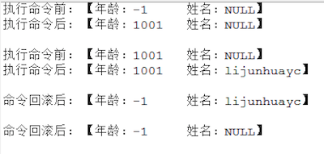

Android设计模式源码解析之命令模式 
====================================
> 本文为 [Android 设计模式源码解析](https://github.com/simple-android-framework-exchange/android_design_patterns_analysis) 中 命令模式 分析  
> Android系统版本： 2.3        
> 分析者：[lijunhuayc](https://github.com/lijunhuayc)，分析状态：完成，校对者：[Mr.Simple](https://github.com/bboyfeiyu)，校对状态：未开始   

## 1. 模式介绍  
 
###  模式的定义
将一个请求封装成一个对象，从而使你可用不同的请求对客户进行参数化，对请求排队或记录请求日志，以及支持可撤销的操作。

### 模式的使用场景
1. 系统需要将请求调用者和请求接收者解耦，使得调用者和接收者不直接交互。
2. 系统需要在不同的时间指定请求、将请求排队和执行请求。
3. 系统需要支持命令的撤销(Undo)操作和恢复(Redo)操作。
4. 系统需要将一组操作组合在一起，即支持宏命令。

## 2. UML类图
 


### 角色介绍
* 命令角色（Command）：定义命令的接口，声明具体命令类需要执行的方法。这是一个抽象角色。

* 具体命令角色（ConcreteCommand）：命令接口的具体实现对象，通常会持有接收者，并调用接收者的功能来完成命令要执行的操作。

* 调用者角色（Invoker）：负责调用命令对象执行请求，通常会持有命令对象（可以持有多个命令对象）。Invoker是Client真正触发命令并要求命令执行相应操作的地方（使用命令对象的入口）。

* 接受者角色（Receiver）：Receiver是真正执行命令的对象。任何类都可能成为一个接收者，只要它能够实现命令要求实现的相应功能。

* 客户角色（Client）：Client可以创建具体的命令对象，并且设置命令对象的接收者。Tips：不能把Clinet理解为我们平常说的客户端，这里的Client是一个组装命令对象和接受者对象的角色，或者你把它理解为一个装配者。

## 3. 模式的简单实现
###  简单实现的介绍
命令模式其实就是对命令进行封装，将命令请求者和命令执行者的责任分离开来实现松耦合。
这里我们通过一个简单的实例来剖析一下命令模式：命令接收者ReceiverRole拥有一个PeopleBean类型成员，通过Invoker发出不同的命令来修改PeopleBean的相对应的属性，具体命令实现类ConcreteCommandImpl1执行修改年龄命令，ConcreteCommandImpl2执行修改姓名的命令等等，ClientRole负责组装各个部分。
例子代码如下（resource目录下也可以查看）。

### 实现源码

```java
    package com.command;
    /**
     * 命令接口    [命令角色]
     */
    public interface Command {
    	public void execute();
    	public void undo();
    	public void redo();
    }
    
```

ConcreteCommandImpl1.java类.     


```java    

    package com.command;
    /**
     * 更新年龄的命令类  [ 具体命令角色 ]
     */
    public class ConcreteCommandImpl1 implements Command{
    	private ReceiverRole receiverRole1;
    
    	public ConcreteCommandImpl1(ReceiverRole receiverRole1) {
    		this.receiverRole1 = receiverRole1;
    	}
    	
    	@Override
    	public void execute() {
    		/*
    		 * 可以加入命令排队等等，未执行的命令支持redo操作
    		 */
    		receiverRole1.opActionUpdateAge(1001);//执行具体的命令操作
    	}
    
    	@Override
    	public void undo() {
    		receiverRole1.rollBackAge();//执行具体的撤销回滚操作
    	}
    
    	@Override
    	public void redo() {
    		//在命令执行前可以修改命令的执行
    	}
    }
```

ConcreteCommandImpl2.java类.    

```java
    package com.command;
    /**
     * 更新姓名的命令类[具体命令角色]
     */
    public class ConcreteCommandImpl2 implements Command{
    	private ReceiverRole receiverRole1;
    
    	public ConcreteCommandImpl2(ReceiverRole receiverRole1) {
    		this.receiverRole1 = receiverRole1;
    	}
    	
    	@Override
    	public void execute() {
    		/*
    		 * 可以加入命令排队等等，未执行的命令支持redo操作
    		 */
    		receiverRole1.opActionUpdateName("lijunhuayc");//执行具体的命令操作
    	}
    
    	@Override
    	public void undo() {
    		receiverRole1.rollBackName();//执行具体的撤销回滚操作
    	}
    
    	@Override
    	public void redo() {
    		//在命令执行前可以修改命令的执行
    	}
    	
    }
```

InvokerRole.java.      

```java
    package com.command;
    /**
     * 命令调用[调用者角色]
     */
    public class InvokerRole {
    	private Command command1;
    	private Command command2;
    	//持有多个命令对象[实际的情况也可能是一个命令对象的集合来保存命令对象]
    	
    	public void setCommand1(Command command1) {
    		this.command1 = command1;
    	}
    	public void setCommand2(Command command2) {
    		this.command2 = command2;
    	}
    	
    	/**
    	 * 执行正常命令，1执行回滚命令
    	 */
    	public void invoke(int args) {
    		//可以根据具体情况选择执行某些命令
    		if(args == 0){
    			command1.execute();
    			command2.execute();
    		}else if(args == 1){
    			command1.undo();
    			command2.undo();
    		}
    	}
    	
    }
```

ReceiverRole.java.    

```java
    package com.command;
    /**
     * 命令的具体执行类[接收者角色], 命令接收者可以是任意的类，只要实现了命令要求实现的相应功能即可。
     */
    public class ReceiverRole {
    	private PeopleBean people;
    	//具体命令操作的缓存栈，用于回滚。这里为了方便就用一个PeopleBean来代替    
    	private PeopleBean peopleCache = new PeopleBean();     	public ReceiverRole() {
    		this.people = new PeopleBean(-1, "NULL");//初始化年龄为-1，姓名为NULL
    	}
    	
    	public ReceiverRole(PeopleBean people) {
    		this.people = people;
    	}
	
	/**
	 * 具体操作方法[修改年龄和姓名]
	 */
	public void opActionUpdateAge(int age) {
		System.out.println("执行命令前："+people.toString());
		this.people.update(age);
		System.out.println("执行命令后："+people.toString()+"\n");
	}
	
	//修改姓名
	public void opActionUpdateName(String name) {
		System.out.println("执行命令前："+people.toString());
		this.people.update(name);
		System.out.println("执行命令后："+people.toString()+"\n");
	}
	
	/**
	 * 回滚操作，用于撤销opAction执行的改变
	 */
	public void rollBackAge() {
		people.setAge(peopleCache.getAge());
		System.out.println("命令回滚后："+people.toString()+"\n");
	}
	public void rollBackName() {
		people.setName(peopleCache.getName());
		System.out.println("命令回滚后："+people.toString()+"\n");
	}
}
```

PeopleBean.java     

```java
    package com.command;
    /**
     * @Desc: 辅助类，作为接收者Receiver的成员，包含两个属性，用来观察命令的执行情况
     * @author ljh
     * @date 2015-3-16 上午11:29:11
     */
    public class PeopleBean {
    	private int age = -1;	//年龄
    	private String name = "NULL";	//姓名
    	public PeopleBean() {
    	}
    	public PeopleBean(int age, String name) {
    		this.age = age;
    		this.name = name;
    	}
    	public void update(int age, String name) {
    		this.age = age;
    		this.name = name;
    	}
    	public void update(int age) {
    		this.age = age;
    	}
    	public void update(String name) {
    		this.name = name;
    	}
    	/**
    	 * @return 返回一个PeopleBean的克隆对象
    	 */
    	protected PeopleBean clone(){
    		return new PeopleBean(age, name);
    	}
    	@Override
    	public String toString() {
    		return " 【年龄：" + age + "\t姓名：" + name + "】";
    	}
    	// setter and getter 
    	
    }
```     

ClientRole.java    

```java
    package com.command;
    /**
     * 命令对象和接受者对象的组装类[客户角色].
     * 我这把类名定义成ClientRole更方便读者理解这只是命令模式中的一个客户角色，而不是我们常规意义上说的客户端
     */
    public class ClientRole {
    	/**
    	 * 组装操作
    	 */
    	public void assembleAction() {
    		//创建一个命令接收者
    		ReceiverRole receiverRole1 = new ReceiverRole();    			//创建一个命令的具体实现对象，并指定命令接收者
    		Command command1 = new ConcreteCommandImpl1(receiverRole1);           		    Command command2 = new ConcreteCommandImpl2(receiverRole1);
    
    		InvokerRole invokerRole = new InvokerRole();//创建一个命令调用者
    		invokerRole.setCommand1(command1);//为调用者指定命令对象1
    		invokerRole.setCommand2(command2);//为调用者指定命令对象2
    		invokerRole.invoke(0);				//发起调用命令请求
    		invokerRole.invoke(1);				//发起调用命令请求
    	}
    }
```

测试类.    

```java
    package com.command;

    public class MainTest {
    	public static void main(String[] args) {
    		ClientRole client = new ClientRole();
    		client.assembleAction();
    	}
    }
```

输出结果如下：       



### 总结
* 每一个命令都是一个操作：请求的一方发出请求，要求执行一个操作；接收的一方收到请求，并执行操作。
* 命令模式允许请求的一方和接收的一方独立开来，使得请求的一方不必知道接收请求的一方的接口，更不必知道请求是怎么被接收，以及操作是否被执行、何时被执行，以及是怎么被执行的。
* 命令模式使请求本身成为一个对象，这个对象和其他对象一样可以被存储和传递。
* 命令模式的关键在于引入了抽象命令接口，且发送者针对抽象命令接口编程，只有实现了抽象命令接口的具体命令才能与接收者相关联。

## Android源码中的模式实现
Command接口中定义了一个execute方法，客户端通过Invoker调用命令操作再来调用Recriver执行命令；把对Receiver的操作请求封装在具体的命令中，使得命令发起者和命令接收者解耦。
以Android中大家常见的Runnable为例：客户端只需要new Thread(new Runnable(){}).start()就开始执行一系列相关的请求，这些请求大部分都是实现Runnable接口的匿名类。
【O_o 模式就在我们身边~】

命令接口Runnable接口定义如下：    

```
package java.lang;
/**
 * Represents a command that can be executed. Often used to run code in a
 * different {@link Thread}.
 */
public interface Runnable {

    /**
     * Starts executing the active part of the class' code. This method is
     * called when a thread is started that has been created with a class which
     * implements {@code Runnable}.
     */
    public void run();
}
```

调用者Thread源码如下（省略部分代码）：
Tips：命令模式在这里本来不需要继承Runnable接口，但为了方便性等，继承了Runnable接口实现了run方法，这个run是Thread自身的运行run的方法，而不是命令Runnable的run。    

```
public class Thread implements Runnable {
    //省略部分无关代码...
    /* some of these are accessed directly by the VM; do not rename them */
    volatile VMThread vmThread;
    volatile ThreadGroup group;
    volatile boolean daemon;
    volatile String name;
    volatile int priority;
    volatile long stackSize;
    Runnable target;
    private static int count = 0;
    
    public synchronized void start() {
        if (hasBeenStarted) {
            throw new IllegalThreadStateException("Thread already started."); // TODO Externalize?
        }

        hasBeenStarted = true;

        VMThread.create(this, stackSize);
    }
    //省略部分代码...
}
```    

上面可以看到执行start()方法的时候实际执行了VMThread.create(this, stackSize)方法；create是VMThread的本地方法，其JNI实现在 android/dalvik/vm/native/java_lang_VMThread.cpp 中的 Dalvik_java_lang_VMThread_create方法，如下：      

```
static void Dalvik_java_lang_VMThread_create(const u4* args, JValue* pResult)
{
    Object* threadObj = (Object*) args[0];
    s8 stackSize = GET_ARG_LONG(args, 1);

    /* copying collector will pin threadObj for us since it was an argument */
    dvmCreateInterpThread(threadObj, (int) stackSize);
    RETURN_VOID();
}
```    

而dvmCreateInterpThread的实现在Thread.app中，如下：    

```
bool dvmCreateInterpThread(Object* threadObj, int reqStackSize){
    Thread* self = dvmThreadSelf();
    
    Thread* newThread = allocThread(stackSize); 
    newThread->threadObj = threadObj;
    
    Object* vmThreadObj = dvmAllocObject(gDvm.classJavaLangVMThread, ALLOC_DEFAULT);
    dvmSetFieldInt(vmThreadObj, gDvm.offJavaLangVMThread_vmData, (u4)newThread);
    dvmSetFieldObject(threadObj, gDvm.offJavaLangThread_vmThread, vmThreadObj);
    
    pthread_t threadHandle;
    int cc = pthread_create(&threadHandle, &threadAttr, interpThreadStart, newThread);

    dvmLockThreadList(self);

    assert(newThread->status == THREAD_STARTING);
    newThread->status = THREAD_VMWAIT;
    pthread_cond_broadcast(&gDvm.threadStartCond);

    dvmUnlockThreadList();
    
}

static Thread* allocThread(int interpStackSize)
{
    Thread* thread;
    thread = (Thread*) calloc(1, sizeof(Thread));
    
    thread->status = THREAD_INITIALIZING;
}
```   

这里是底层代码，简单介绍下就行了：
第4行通过调用 allocThread 创建一个名为newThread的dalvik Thread并设置一些属性，第5行设置其成员变量threadObj为传入的Android Thread，这样dalvik Thread就与Android Thread对象关联起来了；第7行然后创建一个名为vmThreadObj的VMThread对象，设置其成员变量vmData为前面创建的newThread，设置 Android Thread threadObj的成员变量vmThread为这个vmThreadObj，这样Android Thread通过VMThread的成员变量vmData就和dalvik Thread关联起来了。       

接下来在12行通过pthread_create创建pthread线程，并让这个线程start，这样就会进入该线程的thread entry运行，下来我们来看新线程的thread entry方法 interpThreadStart，同样只列出关键的地方：

```
//pthread entry function for threads started from interpreted code.
static void* interpThreadStart(void* arg){
    Thread* self = (Thread*) arg;
    std::string threadName(dvmGetThreadName(self));
    setThreadName(threadName.c_str());

    //Finish initializing the Thread struct.
    dvmLockThreadList(self);
    prepareThread(self);

    while (self->status != THREAD_VMWAIT)
        pthread_cond_wait(&gDvm.threadStartCond, &gDvm.threadListLock);

    dvmUnlockThreadList();

    /*
     * Add a JNI context.
     */
    self->jniEnv = dvmCreateJNIEnv(self);

    //修改状态为THREAD_RUNNING
    dvmChangeStatus(self, THREAD_RUNNING);
    
    //执行run方法
    Method* run = self->threadObj->clazz->vtable[gDvm.voffJavaLangThread_run];

    JValue unused;
    ALOGV("threadid=%d: calling run()", self->threadId);
    assert(strcmp(run->name, "run") == 0);
    dvmCallMethod(self, run, self->threadObj, &unused);
    ALOGV("threadid=%d: exiting", self->threadId);
    
    //移出线程并释放资源
    dvmDetachCurrentThread();
    return NULL;
}

//Finish initialization of a Thread struct.
static bool prepareThread(Thread* thread){
    assignThreadId(thread);
    thread->handle = pthread_self();
    thread->systemTid = dvmGetSysThreadId();
    setThreadSelf(thread);
    return true;
}

//Explore our sense of self.  Stuffs the thread pointer into TLS.
static void setThreadSelf(Thread* thread){
    int cc;
    cc = pthread_setspecific(gDvm.pthreadKeySelf, thread);
}
```    

在新线程的interpThreadStart方法中，首先设置线程的名字，然后调用prepareThread设置线程id以及其它一些属性，其中调用了setThreadSelf将新dalvik Thread自身保存在TLS中，这样之后就能通过dvmThreadSelf方法从TLS中获取它。然后在29行处修改状态为THREAD_RUNNING，并在36行调用对应Android Thread的run()方法，其中调用了Runnable的run方法，运行我们自己的代码。
绕这么深才执行到我们的run方法，累不累？ v_v      

```
    /**
     * Calls the <code>run()</code> method of the Runnable object the receiver
     * holds. If no Runnable is set, does nothing.
     * @see Thread#start
     */
    public void run() {
        if (target != null) {
            target.run();
        }
    }
```   

到此我们已经完成一次命令调用，至于底层run调用完毕后续执行代码，读者可以自行跟进看看~~~


## 4. 杂谈
###优点与缺点
####优点
1. 降低对象之间的耦合度。
2. 新的命令可以很容易地加入到系统中。
3. 可以比较容易地设计一个组合命令。
4. 调用同一方法实现不同的功能

####缺点
使用命令模式可能会导致某些系统有过多的具体命令类。因为针对每一个命令都需要设计一个具体命令类，因此某些系统可能需要大量具体命令类，这将影响命令模式的使用。       
比如上面的PeopleBean的属性增加，Receiver针对PeopleBean一个属性一个执行方法，一个Command的实现可以调用Receiver的一个执行方法，由此得需要设计多少个具体命令类呀！！
