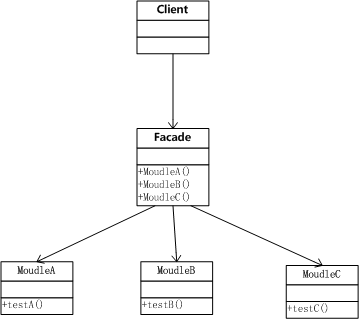

Android设计模式源码解析之外观模式 
====================================
> 本文为 [Android 设计模式源码解析](https://github.com/simple-android-framework/android_design_patterns_analysis) 中 外观模式 分析  
> Android系统版本： 2.3         
> 分析者：[elsdnwn](https://github.com/elsdnwn)，分析状态：已完成，校对者：[Mr.Simple](https://github.com/bboyfeiyu)，校对状态：未开始   

`问题有两个: 1、简单实现的示例需要更具体一些，比如模拟使用facade模式来实现某个确切功能；2、没有对Android源码中使用的Facade模式进行分析。`    可以参考[Mr.Simple的单例模式分析](../../singleton/mr.simple)  


## 1. 模式介绍  
 
###  模式的定义
  外观模式(Facade)，又称门面模式，为子系统中的一组接口提供一个一致的界面，此模式定义了一个高层接口，让客户端直接调用，实现了客户端和子系统中模块的解耦，让客户端更容易的使用此系统。

### 模式的使用场景
	1、在设计初期阶段，将不同的两个层分离；
	2、在开发阶段，子系统往往因为不断的重构演化而变得越来越复杂，大多数的模式使用时也都会产生很多很小的类，这本是好事，但也给外部调用它们的用户程序带来了使用上的困难，增加外观Facade可以提供一个简单的接口，减少它们之间的依赖。
	3、在维护一个遗留的大型系统时，可能这个系统已经非常难以维护和扩展了，但因为它包含非常重要的功能，新的需求开发必须依赖于它。

## 2. UML类图
 

### 角色介绍
* Client : 客户端。
* Facade : 外观类，将客户端请求给子系统。
* MoudleA : 子系统类A，处理Facade外观类对象指派的请求。
* MoudleB : 子系统类B，处理Facade外观类对象指派的请求。
* MoudleC : 子系统类C，处理Facade外观类对象指派的请求。


## 3. 模式的简单实现
###  简单实现的介绍
外观模式比较简单，在开发过程中也经常用到，所以直接贴代码。

### 实现源码

```
package com.elsdnwn.Facade;

/**
 * @ClassName ModuleA
 * @Description 子系统A功能处理 
 * @author elsdnwn
 */
public class ModuleA {
	// do soming...
	public void testA() {
		System.out.println("Call the testA ModuleA method.");
	}
}


package com.elsdnwn.Facade;

/**
 * @ClassName ModuleB
 * @Description 子系统B功能处理 
 * @author elsdnwn
 */
public class ModuleB {
	// do soming...
	public void testB() {
		System.out.println("Call the testB ModuleB method.");
	}
}


package com.elsdnwn.Facade;

/**
 * @ClassName ModuleC
 * @Description 子系统C功能处理 
 * @author elsdnwn
 */
public class ModuleC {
	// do soming...
	public void testC() {
		System.out.println("Call the testC ModuleC method.");
	}
}


package com.elsdnwn.Facade;

/**
 * @ClassName Facade
 * @Description 满足客户端需要的功能
 * @author elsdnwn
 */
public class Facade {
	// 满足客户端需要的功能
	public void test() {
		ModuleA a = new ModuleA();
		a.testA();
		ModuleB b = new ModuleB();
		b.testB();
		ModuleC c = new ModuleC();
		c.testC();
	}
}


package com.elsdnwn.Facade;

/**
 * @ClassName Test
 * @Description 测试类
 * @author elsdnwn
 */
public class Test {

	public static void main(String[] args) {

		Facade facade = new Facade();
		facade.test();
	}

}

输出结果：

Call the testA ModuleA method.
Call the testB ModuleB method.
Call the testC ModuleC method.

``` 


## 4. 杂谈
### 优点与缺点
#### 优点  
* 使用方便，使用外观模式客户端完全不需要知道子系统的实现过程；
* 降低客户端与子系统的耦合；

#### 缺点 
* 减少了可变性和灵活性；
* 在不引入抽象外观类的情况下，增加新的子系统可能需要修改外观类或客户端的源代码，违背了“开闭原则”；


