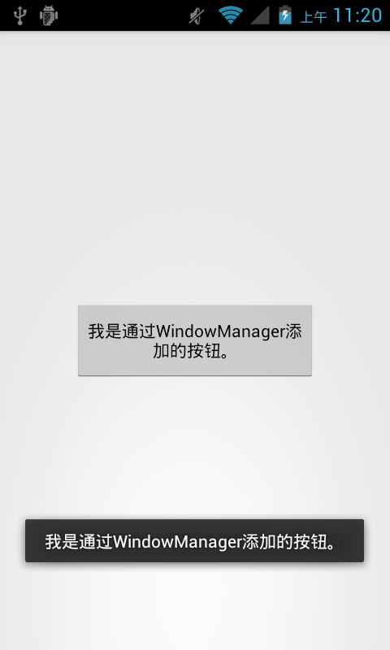

Android设计模式源码解析之外观模式(Facade)
====================================
> 本文为 [Android 设计模式源码解析](https://github.com/simple-android-framework/android_design_patterns_analysis) 中 外观模式 分析  
> Android系统版本： 2.3         
> 分析者：[elsdnwn](https://github.com/elsdnwn)，分析状态：已完成，校对者：[Mr.Simple](https://github.com/bboyfeiyu)，校对状态：未开始   


## 1. 模式介绍  
 
###  模式的定义
  外观模式(Facade)，又称门面模式，为子系统中的一组接口提供一个一致的界面，此模式定义了一个高层接口，让客户端直接调用，实现了客户端和子系统中模块的解耦，让客户端更容易的使用此系统。

### 模式的使用场景
	1、在设计初期阶段，将不同的两个层分离；
	2、在开发阶段，子系统往往因为不断的重构演化而变得越来越复杂，大多数的模式使用时也都会产生很多很小的类，这本是好事，但也给外部调用它们的用户程序带来了使用上的困难，增加外观Facade可以提供一个简单的接口，减少它们之间的依赖。
	3、在维护一个遗留的大型系统时，可能这个系统已经非常难以维护和扩展了，但因为它包含非常重要的功能，新的需求开发必须依赖于它。

## 2. UML类图
 

### 角色介绍
* CustomerA : 顾客A去超市购买所需物品。
* CustomerB : 顾客B去超市购买所需物品。
* Supermarket : 超市，专门销售厂商的物品，供顾客购买。
* Towel : 毛巾类，TowelFactory:生成毛巾的厂商。
* Vegetables : 蔬菜类，VegetablesFactory:种植蔬菜的厂商。
* Computer : 电脑类，ComputerFactory:生产电脑的厂商。


## 3. 模式的简单实现
###  简单实现的介绍
外观模式比较简单，在开发过程中也经常用到，所以直接贴代码。

### 实现源码

```
package com.elsdnwn.Facade;

/**
 * @ClassName Towel
 * @Description 一个毛巾类
 * @author elsdnwn  
 */
class Towel {
	public String toString() {
		return "一条毛巾";
	}
}

/**
 * @ClassName TowelFactory
 * @Description 生成毛巾的厂商
 * @author elsdnwn  
 */
class TowelFactory {
	/**
	 * 卖毛巾
	 */
	public Towel saleTowel() {
		return new Towel();
	}
}


package com.elsdnwn.Facade;

/**
 * @ClassName Vegetables
 * @Description 一个蔬菜类
 * @author elsdnwn  
 */
class Vegetables {
	public String toString() {
		return "一箱蔬菜";
	}
}

/**
 * @ClassName VegetablesFactory
 * @Description 种植蔬菜的厂商 
 * @author elsdnwn
 */
class VegetablesFactory {
	/**
	 * 卖蔬菜
	 */
	public Vegetables saleVegetables() {
		return new Vegetables();
	}
}


package com.elsdnwn.Facade;

/**
 * @ClassName Computer
 * @Description 一个电脑类
 * @author elsdnwn  
 */
class Computer {
	public String toString() {
		return "一台笔记本";
	}
}

/**
 * @ClassName ComputerFactory
 * @Description 生产电脑的厂商 
 * @author elsdnwn
 */
class ComputerFactory {
	/**
	 * 卖电脑
	 */
	public Computer saleComputer() {
		return new Computer();
	}
}


package com.elsdnwn.Facade;

/**
 * @ClassName Supermarket
 * @Description 超市(沃尔玛、家乐福、丹尼斯) ，专门销售厂商的物品，供顾客购买
 * @author elsdnwn  
 */
public class Supermarket {

	/**
	 * 超市销售毛巾
	 */
	public Towel saleTowel() {
		TowelFactory mTowelFactory = new TowelFactory();
		return mTowelFactory.saleTowel();
	}

	/**
	 * 超市销售蔬菜
	 */
	public Vegetables saleVegetables() {
		VegetablesFactory mVegetablesFactory = new VegetablesFactory();
		return mVegetablesFactory.saleVegetables();
	}

	/**
	 * 超市销售电脑
	 */
	public Computer saleComputer() {
		ComputerFactory mComputerFactory = new ComputerFactory();
		return mComputerFactory.saleComputer();
	}
}


package com.elsdnwn.Facade;

/**
 * @ClassName Test
 * @Description 顾客A来到超市购买所需物品，不需要跑到生产厂商那里，也不用管物品是怎么生产的
 * @author elsdnwn  
 */
public class CustomerA {

	public static void main(String[] args) {
		Supermarket mSupermarketA = new Supermarket();
		// 买毛巾
		System.out.println("顾客A买了：" + mSupermarketA.saleTowel());
		// 买蔬菜
		System.out.println("顾客A买了：" + mSupermarketA.saleVegetables());
		// 买电脑
		System.out.println("顾客A买了：" + mSupermarketA.saleComputer());

	}

}

``` 

输出结果：

``` 
顾客A买了：一条毛巾
顾客A买了：一箱蔬菜
顾客A买了：一台笔记本
``` 

``` 
package com.elsdnwn.Facade;

/**
 * @ClassName Test
 * @Description 顾客B来到超市购买所需物品，不需要跑到生产厂商那里，也不用管物品是怎么生产的
 * @author elsdnwn  
 */
public class CustomerB {

	public static void main(String[] args) {
		Supermarket customerB = new Supermarket();
		// 买毛巾
		System.out.println("顾客B买了：" + customerB.saleTowel());
		// 买蔬菜
		System.out.println("顾客B买了：" + customerB.saleVegetables());
		// 买电脑
		System.out.println("顾客B买了：" + customerB.saleComputer());

	}

}
``` 

输出结果：

``` 
顾客B买了：一条毛巾
顾客B买了：一箱蔬菜
顾客B买了：一台笔记本
``` 


## Android源码中的模式实现
在Android 系统中使用的外观模式的地方比较多，可以说每个系统服务都对客户提供了一个访问该系统服务的管理门户类，用来方便访问对应的系统服务，如窗口管理服务对应的WindowManager，输入管理服务对应的InputManager，活动管理服务对应的ActivityManager等等。
另外ContentResolver、Log、Context、ServiceManager也可以看作外观模式的采用。

整个Android的窗口机制是基于一个叫做 WindowManager，这个接口可以添加view到屏幕，也可以从屏幕删除view。它面向的对象一端是屏幕，另一端就是View，通过WindowManager的 addView方法创建View，这样产生出来的View根据WindowManager.LayoutParams属性不同，效果也就不同了。比如创建 系统顶级窗口，实现悬浮窗口效果！WindowManager的方法很简单，基本用到的就三addView，removeView，updateViewLayout。
简单示例如下 :
``` 
package com.elsdnwn.Facade;

import android.app.Activity;
import android.content.Context;
import android.os.Bundle;
import android.view.View;
import android.view.View.OnClickListener;
import android.view.WindowManager;
import android.widget.Button;
import android.widget.Toast;

public class MainActivity extends Activity {

	@Override
	protected void onCreate(Bundle savedInstanceState) {
		super.onCreate(savedInstanceState);
		// 去掉title
		requestWindowFeature(Window.FEATURE_NO_TITLE);
		setContentView(R.layout.activity_main);

		Button mBtn = new Button(this);
		mBtn.setText("我是通过WindowManager添加的按钮。");
		mBtn.setTextSize(14.0f);
		mBtn.setOnClickListener(new OnClickListener() {

			@Override
			public void onClick(View v) {
				Toast.makeText(MainActivity.this, "我是通过WindowManager添加的按钮。", Toast.LENGTH_SHORT).show();
			}
		});

		WindowManager mWindowManager = (WindowManager) getSystemService(Context.WINDOW_SERVICE);
		WindowManager.LayoutParams wmParams = new WindowManager.LayoutParams();
		/**
		 * 以下都是WindowManager.LayoutParams的相关属性 具体用途请参考SDK文档
		 */
		wmParams.type = 1;
		wmParams.format = 1;
		/**
		 * 这里的flags也很关键 代码实际是wmParams.flags |= FLAG_NOT_FOCUSABLE;
		 * 40的由来是wmParams的默认属性（32）+ FLAG_NOT_FOCUSABLE（8）
		 */
		wmParams.flags = 40;
		wmParams.width = 300;
		wmParams.height = 100;

		mWindowManager.addView(mBtn, wmParams); // 创建View

	}
}

``` 

结果： 

需要注意的是：设置requestWindowFeature(Window.FEATURE_NO_TITLE)一定要在setContentView()方法之前；

下面我们看看WindowManager的源码：

``` 
	// WindowManager Source
	public interface WindowManager extends ViewManager {
		
		// 代码略...

	    /**
	     * 获取默认显示的 Display对象
	     */
	    public Display getDefaultDisplay();

	    /**
	     * 是removeView(View) 的一个特殊扩展
	     * 在方法返回前能够立即调用该视图层次的View.onDetachedFromWindow() 方法。
	     */
	    public void removeViewImmediate(View view);

	    /**
	     * WindowManager的LayoutParams子类内容十分丰富。其实WindowManager.java的主要内容就是由这个类定义构成。它的定义如下：
	     */
	    public static class LayoutParams extends ViewGroup.LayoutParams implements Parcelable {

	    	/**
	         * 如果忽略gravity属性，那么它表示窗口的绝对X位置。 
	         * 什么是gravity属性呢？简单地说，就是窗口如何停靠。
	         * 当设置了 Gravity.LEFT 或 Gravity.RIGHT之后，x值就表示到特定边的距离。
	         */
	    	@ViewDebug.ExportedProperty
	        public int x;
	        
	    	/**
	         * 如果忽略gravity属性，那么它表示窗口的绝对Y位置。 
	         * 什么是gravity属性呢？简单地说，就是窗口如何停靠。
	         * 当设置了 Gravity.TOP 或 Gravity.BOTTOM之后，y值就表示到特定边的距离。
	         */
	        @ViewDebug.ExportedProperty
	        public int y;

	        /**
	         * 在水平/垂直上显示多少额外的空间将分配水平/垂直与这些LayoutParams相关联的view。
	         * 如果是0，那么此view就不能被延伸。否则,这些额外的像素将被widget所均分。
	         */
	        @ViewDebug.ExportedProperty
	        public float horizontalWeight;

	        @ViewDebug.ExportedProperty
	        public float verticalWeight;
	        
	    	// 代码略...
	    }
	}
``` 


## 4. 杂谈
### 优点与缺点
#### 优点  
* 使用方便，使用外观模式客户端完全不需要知道子系统的实现过程；
* 降低客户端与子系统的耦合；
* 更好的划分访问层次；

#### 缺点 
* 减少了可变性和灵活性；
* 在不引入抽象外观类的情况下，增加新的子系统可能需要修改外观类或客户端的源代码，违背了“开闭原则”；


