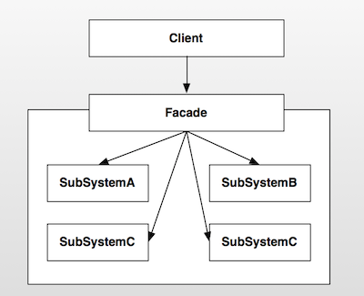
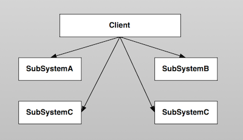
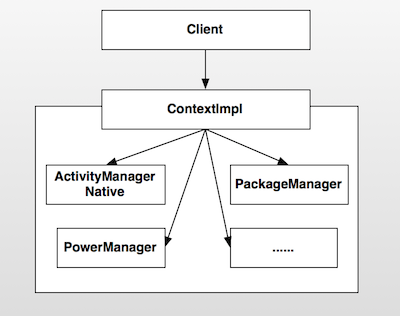

Android设计模式源码解析之外观模式(Facade)
====================================
> 本文为 [Android 设计模式源码解析](https://github.com/simple-android-framework-exchange/android_design_patterns_analysis) 中 外观模式 分析  
> Android系统版本： 2.3         
> 分析者：[elsdnwn](https://github.com/elsdnwn)、[Mr.Simple](https://github.com/bboyfeiyu)，分析状态：已完成，校对者：[Mr.Simple](https://github.com/bboyfeiyu)，校对状态：未开始   


## 1. 模式介绍  
 
###  模式的定义
外观模式(也成为门面模式)要求一个子系统的外部与其内部的通信必须通过一个统一的对象进行。它提供一个高层次的接口，使得子系统更易于使用。

### 模式的使用场景
1. 在设计初期阶段，将不同的两个层分离；
2. 在开发阶段，子系统往往因为不断的重构演化而变得越来越复杂，大多数的模式使用时也都会产生很多很小的类，这本是好事，但也给外部调用它们的用户程序带来了使用上的困难，增加外观Facade可以提供一个简单的接口，减少它们之间的依赖。
3. 在维护一个遗留的大型系统时，可能这个系统已经非常难以维护和扩展了，但因为它包含非常重要的功能，新的需求开发必须依赖于它。

## 2. UML类图
 

### 角色介绍
* Client : 客户端程序。
* Facade : 对外的统一入口,即外观对象。
* SubSystemA : 子系统A。
* SubSystemB : 子系统B。
* SubSystemC : 子系统C。
* SubSystemD : 子系统D。

## 不使用外观模式
      
如上述所说，门面模式提供一个高层次的接口，使得子系统更易于使用。因此在不使用该模式的情况下，客户端程序使用相关功能的成本就会比较的复杂，需要和各个子系统进行交互 ( 如上图 )，这样就使得系统的稳定性受到影响，用户的使用成本也相对较高。      


## 3. 模式的简单实现
###  简单实现的介绍
电视遥控器是现实生活中一个比较好的外观模式的运用，遥控器可以控制电源的开源、声音的调整、频道的切换等。这个遥控器就是我们这里说的外观或者门面，而电源、声音、频道切换系统就是我们的子系统。遥控器统一对这些子模块的控制，我想你没有用过多个遥控器来分别控制电源开关、声音控制等功能。下面我们就来简单模拟一下这个系统。     

### 实现源码
TvController.java   

```java
public class TvController {
    private PowerSystem mPowerSystem = new PowerSystem();
    private VoiceSystem mVoiceSystem = new VoiceSystem();
    private ChannelSystem mChannelSystem = new ChannelSystem();

    public void powerOn() {
        mPowerSystem.powerOn();
    }

    public void powerOff() {
        mPowerSystem.powerOff();
    }

    public void turnUp() {
        mVoiceSystem.turnUp();
    }

    public void turnDown() {
        mVoiceSystem.turnDown();
    }

    public void nextChannel() {
        mChannelSystem.next();
    }

    public void prevChannel() {
        mChannelSystem.prev();
    }
}
```
PowerSystem.java

```java
/**
 * 电源控制系统
 */
 class PowerSystem {
    public void powerOn() {
        System.out.println("开机");
    }

    public void powerOff() {
        System.out.println("关机");
    }
}
```

VoiceSystem.java

```java
/**
 * 声音控制系统
 */
class VoiceSystem {
    public void turnUp() {
        System.out.println("音量增大");
    }

    public void turnDown() {
        System.out.println("音量减小");
    }
}
```


ChannelSystem.java

```java
/**
 * 频道控制系统
 */
class ChannelSystem {
    public void next() {
        System.out.println("下一频道");
    }

    public void prev() {
        System.out.println("上一频道");
    }
}
```

测试代码 :     

```java
public class TvController {
    private PowerSystem mPowerSystem = new PowerSystem();
    private VoiceSystem mVoiceSystem = new VoiceSystem();
    private ChannelSystem mChannelSystem = new ChannelSystem();

    public void powerOn() {
        mPowerSystem.powerOn();
    }

    public void powerOff() {
        mPowerSystem.powerOff();
    }

    public void turnUp() {
        mVoiceSystem.turnUp();
    }

    public void turnDown() {
        mVoiceSystem.turnDown();
    }

    public void nextChannel() {
        mChannelSystem.next();
    }

    public void prevChannel() {
        mChannelSystem.prev();
    }
}

``` 

输出结果：   

```
开机
下一频道
音量增大
关机
``` 
上面的TvController封装了对电源、声音、频道切换的操作，为用户提供了一个统一的接口。使得用户控制电视机更加的方便、更易于使用。        

## Android源码中的模式实现
在开发过程中，Context是最重要的一个类型。它封装了很多重要的操作，比如startActivity()、sendBroadcast()等，几乎是开发者对应用操作的统一入口。Context是一个抽象类，它只是定义了抽象接口，真正的实现在ContextImpl类中。它就是今天我们要分析的外观类。      

在应用启动时，首先会fork一个子进程，并且调用ActivityThread.main方法启动该进程。ActivityThread又会构建Application对象，然后和Activity、ContextImpl关联起来，然后再调用Activity的onCreate、onStart、onResume函数使Activity运行起来。我们看看下面的相关代码:       

```
private final void handleLaunchActivity(ActivityClientRecord r, Intent customIntent) {
		// 代码省略

        // 1、创建并且加载Activity，调用其onCreate函数
        Activity a = performLaunchActivity(r, customIntent);

        if (a != null) {
            r.createdConfig = new Configuration(mConfiguration);
            Bundle oldState = r.state;
            // 2、调用Activity的onResume方法，使Activity变得可见
            handleResumeActivity(r.token, false, r.isForward);

        }
    }


     private final Activity performLaunchActivity(ActivityClientRecord r, Intent customIntent) {
        // System.out.println("##### [" + System.currentTimeMillis() + "] ActivityThread.performLaunchActivity(" + r + ")");
		// 代码省略

        Activity activity = null;
        try {
            java.lang.ClassLoader cl = r.packageInfo.getClassLoader();
            // 1、创建Activity
            activity = mInstrumentation.newActivity(
                    cl, component.getClassName(), r.intent);
            r.intent.setExtrasClassLoader(cl);
            if (r.state != null) {
                r.state.setClassLoader(cl);
            }
        } catch (Exception e) {
            if (!mInstrumentation.onException(activity, e)) {
                throw new RuntimeException(
                    "Unable to instantiate activity " + component
                    + ": " + e.toString(), e);
            }
        }

        try {
            // 2、创建Application
            Application app = r.packageInfo.makeApplication(false, mInstrumentation);

            if (activity != null) {
                // ***** 构建ContextImpl  ****** 
                ContextImpl appContext = new ContextImpl();
                appContext.init(r.packageInfo, r.token, this);
                appContext.setOuterContext(activity);
                // 获取Activity的title
                CharSequence title = r.activityInfo.loadLabel(appContext.getPackageManager());
                Configuration config = new Configuration(mConfiguration);
            
                 // 3、Activity与context, Application关联起来
                activity.attach(appContext, this, getInstrumentation(), r.token,
                        r.ident, app, r.intent, r.activityInfo, title, r.parent,
                        r.embeddedID, r.lastNonConfigurationInstance,
                        r.lastNonConfigurationChildInstances, config);
				// 代码省略

                // 4、回调Activity的onCreate方法
                mInstrumentation.callActivityOnCreate(activity, r.state);
           
                // 代码省略
            }
            r.paused = true;

            mActivities.put(r.token, r);

        } catch (SuperNotCalledException e) {
            throw e;

        } catch (Exception e) {
      
        }

        return activity;
    }


    final void handleResumeActivity(IBinder token, boolean clearHide, boolean isForward) {
   
        unscheduleGcIdler();

        // 1、最终调用Activity的onResume方法
        ActivityClientRecord r = performResumeActivity(token, clearHide);
        // 代码省略
        // 2、这里是重点，在这里使DecorView变得可见
        if (r.window == null && !a.mFinished && willBeVisible) {
                // 获取Window，即PhoneWindow类型
                r.window = r.activity.getWindow();
                // 3、获取Window的顶级视图，并且使它可见
                View decor = r.window.getDecorView();
                decor.setVisibility(View.INVISIBLE);
                // 4、获取WindowManager
                ViewManager wm = a.getWindowManager();
                // 5、构建LayoutParams参数
                WindowManager.LayoutParams l = r.window.getAttributes();
                a.mDecor = decor;
                l.type = WindowManager.LayoutParams.TYPE_BASE_APPLICATION;
                l.softInputMode |= forwardBit;
                if (a.mVisibleFromClient) {
                    a.mWindowAdded = true;
                    // 6、将DecorView添加到WindowManager中，最终的操作是通过WindowManagerService的addView来操作
                    wm.addView(decor, l);
                }
            } else if (!willBeVisible) {
                if (localLOGV) Slog.v(
                    TAG, "Launch " + r + " mStartedActivity set");
                r.hideForNow = true;
            }
            // 代码省略
    }

 public final ActivityClientRecord performResumeActivity(IBinder token,
            boolean clearHide) {
        ActivityClientRecord r = mActivities.get(token);
       
        if (r != null && !r.activity.mFinished) {
                try {
                // 代码省略
                // 执行onResume
                r.activity.performResume();
				// 代码省略
            } catch (Exception e) {
   
            }
        }
        return r;
    }
```    

Activity启动之后，Android给我们提供了操作系统服务的统一入口，也就是Activity本身。这些工作并不是Activity自己实现的，而是将操作委托给Activity父类ContextThemeWrapper的mBase对象，这个对象的实现类就是ContextImpl ( 也就是performLaunchActivity方法中构建的ContextImpl )。


```java
class ContextImpl extends Context {
    private final static String TAG = "ApplicationContext";
    private final static boolean DEBUG = false;
    private final static boolean DEBUG_ICONS = false;

    private static final Object sSync = new Object();
    private static AlarmManager sAlarmManager;
    private static PowerManager sPowerManager;
    private static ConnectivityManager sConnectivityManager;
    private AudioManager mAudioManager;
    LoadedApk mPackageInfo;
    private Resources mResources;
    private PackageManager mPackageManager;
    private NotificationManager mNotificationManager = null;
    private ActivityManager mActivityManager = null;
    
	// 代码省略
    
        @Override
    public void sendBroadcast(Intent intent) {
        String resolvedType = intent.resolveTypeIfNeeded(getContentResolver());
        try {
            ActivityManagerNative.getDefault().broadcastIntent(
                mMainThread.getApplicationThread(), intent, resolvedType, null,
                Activity.RESULT_OK, null, null, null, false, false);
        } catch (RemoteException e) {
        }
    }
    
    
        @Override
    public void startActivity(Intent intent) {
        if ((intent.getFlags()&Intent.FLAG_ACTIVITY_NEW_TASK) == 0) {
            throw new AndroidRuntimeException(
                    "Calling startActivity() from outside of an Activity "
                    + " context requires the FLAG_ACTIVITY_NEW_TASK flag."
                    + " Is this really what you want?");
        }
        mMainThread.getInstrumentation().execStartActivity(
            getOuterContext(), mMainThread.getApplicationThread(), null, null, intent, -1);
    }
    
    
        @Override
    public ComponentName startService(Intent service) {
        try {
            ComponentName cn = ActivityManagerNative.getDefault().startService(
                mMainThread.getApplicationThread(), service,
                service.resolveTypeIfNeeded(getContentResolver()));
            if (cn != null && cn.getPackageName().equals("!")) {
                throw new SecurityException(
                        "Not allowed to start service " + service
                        + " without permission " + cn.getClassName());
            }
            return cn;
        } catch (RemoteException e) {
            return null;
        }
    }
    
        @Override
    public String getPackageName() {
        if (mPackageInfo != null) {
            return mPackageInfo.getPackageName();
        }
        throw new RuntimeException("Not supported in system context");
    }
}
```
可以看到，ContextImpl内部有很多xxxManager类的对象，也就是我们上文所说的各种子系统的角色。ContextImpl内部封装了一些系统级别的操作，有的子系统功能虽然没有实现，但是也提供了访问该子系统的接口，比如获取ActivityManager的getActivityManager方法。      

比如我们要启动一个Activity的时候，我们调用的是startActivity方法，这个功能的内部实现实际上是Instrumentation完成的。ContextImpl封装了这个功能，使得用户根本不需要知晓Instrumentation相关的信息，直接使用startActivity即可完成相应的工作。其他的子系统功能也是类似的实现，比如启动Service和发送广播内部使用的是ActivityManagerNative等。ContextImpl的结构图如下 :            


外观模式非常的简单，只是封装了子系统的操作，并且暴露接口让用户使用，避免了用户需要与多个子系统进行交互，降低了系统的耦合度、复杂度。如果没有外观模式的封装，那么用户就必须知道各个子系统的相关细节，子系统之间的交互必然造成纠缠不清的关系，影响系统的稳定性、复杂度。              


## 4. 杂谈
### 优点与缺点
#### 优点  
* 使用方便，使用外观模式客户端完全不需要知道子系统的实现过程；
* 降低客户端与子系统的耦合；
* 更好的划分访问层次；

#### 缺点 
* 减少了可变性和灵活性；
* 在不引入抽象外观类的情况下，增加新的子系统可能需要修改外观类或客户端的源代码，违背了“开闭原则”；


