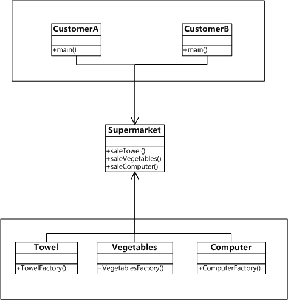

Android设计模式源码解析之外观模式(Facade)
====================================
> 本文为 [Android 设计模式源码解析](https://github.com/simple-android-framework-exchange/android_design_patterns_analysis) 中 外观模式 分析  
> Android系统版本： 2.3         
> 分析者：[elsdnwn](https://github.com/elsdnwn)，分析状态：已完成，校对者：[Mr.Simple](https://github.com/bboyfeiyu)，校对状态：未开始   


## 1. 模式介绍  
 
###  模式的定义
  外观模式(Facade)，又称门面模式，为子系统中的一组接口提供一个一致的界面，此模式定义了一个高层接口，让客户端直接调用，实现了客户端和子系统中模块的解耦，让客户端更容易的使用此系统。

### 模式的使用场景
	1、在设计初期阶段，将不同的两个层分离；
	2、在开发阶段，子系统往往因为不断的重构演化而变得越来越复杂，大多数的模式使用时也都会产生很多很小的类，这本是好事，但也给外部调用它们的用户程序带来了使用上的困难，增加外观Facade可以提供一个简单的接口，减少它们之间的依赖。
	3、在维护一个遗留的大型系统时，可能这个系统已经非常难以维护和扩展了，但因为它包含非常重要的功能，新的需求开发必须依赖于它。

## 2. UML类图
 

### 角色介绍
* CustomerA : 顾客A去超市购买所需物品。
* CustomerB : 顾客B去超市购买所需物品。
* Supermarket : 超市，专门销售厂商的物品，供顾客购买。
* Towel : 毛巾类，TowelFactory:生成毛巾的厂商。
* Vegetables : 蔬菜类，VegetablesFactory:种植蔬菜的厂商。
* Computer : 电脑类，ComputerFactory:生产电脑的厂商。


## 3. 模式的简单实现
###  简单实现的介绍
外观模式比较简单，在开发过程中也经常用到，所以直接贴代码。

### 实现源码

```
package com.elsdnwn.Facade;

/**
 * @ClassName Towel
 * @Description 一个毛巾类
 * @author elsdnwn  
 */
class Towel {
	public String toString() {
		return "一条毛巾";
	}
}

/**
 * @ClassName TowelFactory
 * @Description 生成毛巾的厂商
 * @author elsdnwn  
 */
class TowelFactory {
	/**
	 * 卖毛巾
	 */
	public Towel saleTowel() {
		return new Towel();
	}
}


package com.elsdnwn.Facade;

/**
 * @ClassName Vegetables
 * @Description 一个蔬菜类
 * @author elsdnwn  
 */
class Vegetables {
	public String toString() {
		return "一箱蔬菜";
	}
}

/**
 * @ClassName VegetablesFactory
 * @Description 种植蔬菜的厂商 
 * @author elsdnwn
 */
class VegetablesFactory {
	/**
	 * 卖蔬菜
	 */
	public Vegetables saleVegetables() {
		return new Vegetables();
	}
}


package com.elsdnwn.Facade;

/**
 * @ClassName Computer
 * @Description 一个电脑类
 * @author elsdnwn  
 */
class Computer {
	public String toString() {
		return "一台笔记本";
	}
}

/**
 * @ClassName ComputerFactory
 * @Description 生产电脑的厂商 
 * @author elsdnwn
 */
class ComputerFactory {
	/**
	 * 卖电脑
	 */
	public Computer saleComputer() {
		return new Computer();
	}
}


package com.elsdnwn.Facade;

/**
 * @ClassName Supermarket
 * @Description 超市(沃尔玛、家乐福、丹尼斯) ，专门销售厂商的物品，供顾客购买
 * @author elsdnwn  
 */
public class Supermarket {

	/**
	 * 超市销售毛巾
	 */
	public Towel saleTowel() {
		TowelFactory mTowelFactory = new TowelFactory();
		return mTowelFactory.saleTowel();
	}

	/**
	 * 超市销售蔬菜
	 */
	public Vegetables saleVegetables() {
		VegetablesFactory mVegetablesFactory = new VegetablesFactory();
		return mVegetablesFactory.saleVegetables();
	}

	/**
	 * 超市销售电脑
	 */
	public Computer saleComputer() {
		ComputerFactory mComputerFactory = new ComputerFactory();
		return mComputerFactory.saleComputer();
	}
}


package com.elsdnwn.Facade;

/**
 * @ClassName Test
 * @Description 顾客A来到超市购买所需物品，不需要跑到生产厂商那里，也不用管物品是怎么生产的
 * @author elsdnwn  
 */
public class CustomerA {

	public static void main(String[] args) {
		Supermarket mSupermarketA = new Supermarket();
		// 买毛巾
		System.out.println("顾客A买了：" + mSupermarketA.saleTowel());
		// 买蔬菜
		System.out.println("顾客A买了：" + mSupermarketA.saleVegetables());
		// 买电脑
		System.out.println("顾客A买了：" + mSupermarketA.saleComputer());

	}

}

``` 

输出结果：

``` 
顾客A买了：一条毛巾
顾客A买了：一箱蔬菜
顾客A买了：一台笔记本
``` 

``` 
package com.elsdnwn.Facade;

/**
 * @ClassName Test
 * @Description 顾客B来到超市购买所需物品，不需要跑到生产厂商那里，也不用管物品是怎么生产的
 * @author elsdnwn  
 */
public class CustomerB {

	public static void main(String[] args) {
		Supermarket customerB = new Supermarket();
		// 买毛巾
		System.out.println("顾客B买了：" + customerB.saleTowel());
		// 买蔬菜
		System.out.println("顾客B买了：" + customerB.saleVegetables());
		// 买电脑
		System.out.println("顾客B买了：" + customerB.saleComputer());

	}

}
``` 

输出结果：

``` 
顾客B买了：一条毛巾
顾客B买了：一箱蔬菜
顾客B买了：一台笔记本
``` 


## Android源码中的模式实现
在Android源码中，ContextImpl这个类封装了很多模块（子系统），比如startActivity()、sendBroadcast()等，分别给用户一个统一的操作入口，简单实例如下：

```
package com.elsdnwn.Facade;

import android.app.Activity;
import android.content.Intent;
import android.os.Bundle;

public class MainActivity extends Activity {
	
	@Override
	protected void onCreate(Bundle savedInstanceState) {
		super.onCreate(savedInstanceState);
		setContentView(R.layout.activity_main);

		Intent intent = new Intent();
		intent.setClass(this, MainActivity2.class);
		startActivity(intent);
	}

}

```

通过上面的代码可以看到，启动startActivity需要传递一个Context上下文对象，为什么要传递呢？下面我们看一下ContextImpl相关源码：

```

	@Override
    public void startActivity(Intent intent) {
        if ((intent.getFlags()&Intent.FLAG_ACTIVITY_NEW_TASK) == 0) {
            throw new AndroidRuntimeException(
                    "Calling startActivity() from outside of an Activity "
                    + " context requires the FLAG_ACTIVITY_NEW_TASK flag."
                    + " Is this really what you want?");
        }

		// 其实是用的getInstrumentation().execStartActivity();
        mMainThread.getInstrumentation().execStartActivity(
            getOuterContext(), mMainThread.getApplicationThread(), null,
            (Activity)null, intent, -1);
    }

```

我们可以看出启动Activity其实是用的Instrumentation()类里的getInstrumentation().execStartActivity(); 继续查看Instrumentation类里的execStartActivity()的源码：

```

	/**
	 * 需要接受一个Context上下文对象来确定activity的开始
	 */
	public ActivityResult execStartActivity(
            Context who, IBinder contextThread, IBinder token, Activity target,
            Intent intent, int requestCode, Bundle options) {
        IApplicationThread whoThread = (IApplicationThread) contextThread;
        if (mActivityMonitors != null) {
            synchronized (mSync) {
                final int N = mActivityMonitors.size();
                for (int i=0; i<N; i++) {
                    final ActivityMonitor am = mActivityMonitors.get(i);
                    if (am.match(who, null, intent)) {
                        am.mHits++;
                        if (am.isBlocking()) {
                            return requestCode >= 0 ? am.getResult() : null;
                        }
                        break;
                    }
                }
            }
        }
        // 代码略...
        return null;
    }

```

通过上面的代码可以看出启动Activity需要传递一个上下文Context才可以，通过外观模式我们不需要知道startActivity是怎么启动的，只需要传递上下文Context，这样就大大降低了客户端与子系统的耦合。


## 4. 杂谈
### 优点与缺点
#### 优点  
* 使用方便，使用外观模式客户端完全不需要知道子系统的实现过程；
* 降低客户端与子系统的耦合；
* 更好的划分访问层次；

#### 缺点 
* 减少了可变性和灵活性；
* 在不引入抽象外观类的情况下，增加新的子系统可能需要修改外观类或客户端的源代码，违背了“开闭原则”；


