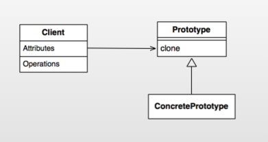
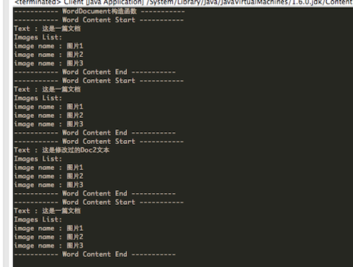
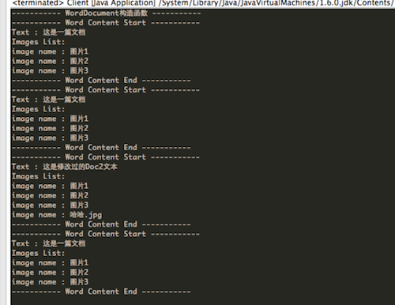
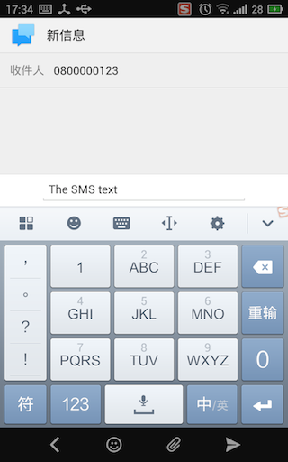

Android设计模式源码解析之原型模式 
====================================
> 本文为 [Android 设计模式源码解析](https://github.com/simple-android-framework-exchange/android_design_patterns_analysis) 中 原型模式 分析  
> Android系统版本： 2.3         
> 分析者：[Mr.Simple](https://github.com/bboyfeiyu)，分析状态：未完成，校对者：[Mr.Simple](https://github.com/bboyfeiyu)，校对状态：完成    

## 1. 模式介绍  
 
###  模式的定义
用原型实例指定创建对象的种类，并通过拷贝这些原型创建新的对象。


### 模式的使用场景
1. 类初始化需要消化非常多的资源，这个资源包括数据、硬件资源等，通过原型拷贝避免这些消耗；
2. 通过 new 产生一个对象需要非常繁琐的数据准备或访问权限，则可以使用原型模式；
3. 一个对象需要提供给其他对象访问，而且各个调用者可能都需要修改其值时，可以考虑使用原型模式拷贝多个对象供调用者使用，即保护性拷贝。 
 

## 2. UML类图


### 角色介绍
* Client  :  客户端用户。
* Prototype : 抽象类或者接口，声明具备clone能力。
* ConcretePrototype : 具体的原型类.


## 3. 模式的简单实现
###  简单实现的介绍   

下面我们以简单的文档拷贝为例来演示一下简单的原型模式模式。     

### 实现源码

```java
package com.dp.example.builder;


package com.dp.example.prototype;

import java.util.ArrayList;
import java.util.List;

/**
 * 文档类型, 扮演的是ConcretePrototype角色，而cloneable是代表prototype角色
 * 
 * @author mrsimple
 */
public class WordDocument implements Cloneable {
    /**
     * 文本
     */
    private String mText;
    /**
     * 图片名列表
     */
    private ArrayList<String><string> mImages = new ArrayList<String><string>();

    public WordDocument() {
        System.out.println("----------- WordDocument构造函数 -----------");
    }

    /**
     * 克隆对象
     */
    @Override
    protected WordDocument clone() {
        try {
            WordDocument doc = (WordDocument) super.clone();
            doc.mText = this.mText;
            doc.mImages = this.mImages;
            return doc;
        } catch (Exception e) {
        }

        return null;
    }

    public String getText() {
        return mText;
    }

    public void setText(String mText) {
        this.mText = mText;
    }

    public List<string> getImages() {
        return mImages;
    }

    /**
     * @param img
     */
    public void addImage(String img) {
        this.mImages.add(img);
    }

    /**
     * 打印文档内容
     */
    public void showDocument() {
        System.out.println("----------- Word Content Start -----------");
        System.out.println("Text : " + mText);
        System.out.println("Images List: ");
        for (String imgName : mImages) {
            System.out.println("image name : " + imgName);
        }
        System.out.println("----------- Word Content End -----------");
    }
}
```

通过WordDocument类模拟了word文档中的基本元素，即文字和图片。WordDocument的在该原型模式示例中扮演的角色为ConcretePrototype， 而Cloneable的角色则为Prototype。WordDocument实现了clone方法以实现对象克隆。下面我们看看Client端的使用 :       

```java
public class Client {
    public static void main(String[] args) {
        WordDocument originDoc = new WordDocument();
        originDoc.setText("这是一篇文档");
        originDoc.addImage("图片1");
        originDoc.addImage("图片2");
        originDoc.addImage("图片3");
        originDoc.showDocument();

        WordDocument doc2 = originDoc.clone();
        doc2.showDocument();
        
        doc2.setText("这是修改过的Doc2文本");
        doc2.showDocument();
         
        originDoc.showDocument();
    }

}
```
输出结果如下 :     


可以看到，doc2是通过originDoc.clone()创建的，并且doc2第一次输出的时候和originDoc输出是一样的。即doc2是originDoc的一份拷贝，他们的内容是一样的，而doc2修改了文本内容以后并不会影响originDoc的文本内容。需要注意的是通过clone拷贝对象的时候并不会执行构造函数！


### 浅拷贝和深拷贝
将main函数的内容修改为如下 :    

```java
    public static void main(String[] args) {
        WordDocument originDoc = new WordDocument();
        originDoc.setText("这是一篇文档");
        originDoc.addImage("图片1");
        originDoc.addImage("图片2");
        originDoc.addImage("图片3");
        originDoc.showDocument();

        WordDocument doc2 = originDoc.clone();
        
        doc2.showDocument();
        
        doc2.setText("这是修改过的Doc2文本");
        doc2.addImage("哈哈.jpg");
        doc2.showDocument();
        
        originDoc.showDocument();
    }
```

输出结果如下 :  
       
细心的朋友可能发现了，在doc2添加了一张名为"哈哈.jpg"的照片，但是却也显示在originDoc中？这是怎么回事呢？  其实学习过C++的朋友都知道，这是因为上文中WordDocument的clone方法中只是简单的进行浅拷贝，引用类型的新对象doc2的mImages只是单纯的指向了this.mImages引用，而并没有进行拷贝。doc2的mImages添加了新的图片，实际上也就是往originDoc里添加了新的图片，所以originDoc里面也有"哈哈.jpg" 。那如何解决这个问题呢？  那就是采用深拷贝，即在拷贝对象时，对于引用型的字段也要采用拷贝的形式，而不是单纯引用的形式。示例如下 :       

```java
    /**
     * 克隆对象
     */
    @Override
    protected WordDocument clone() {
        try {
            WordDocument doc = (WordDocument) super.clone();
            doc.mText = this.mText;
//            doc.mImages = this.mImages;
            doc.mImages = (ArrayList<String>) this.mImages.clone();
            return doc;
        } catch (Exception e) {
        }

        return null;
    }
```

如上代码所示，将doc.mImages指向this.mImages的一份拷贝， 而不是this.mImages本身，这样在doc2添加图片时并不会影响originDoc，如图所示 :      
        
 	

## Android源码中的模式实现
在Android源码中，我们以熟悉的Intent来分析源码中的原型模式。简单示例如下 :      

```java
    Uri uri = Uri.parse("smsto:0800000123");    
    Intent shareIntent = new Intent(Intent.ACTION_SENDTO, uri);    
    shareIntent.putExtra("sms_body", "The SMS text");    
    
    Intent intent = (Intent)shareIntent.clone() ;
    startActivity(intent);
```

结果如下 :

        

可以看到，我们通过shareIntent.clone方法拷贝了一个对象intent, 然后执行startActivity(intent)， 随即就进入了短信页面，号码为0800000123,文本内容为The SMS text，即这些内容都与shareIntent一致。   

```java
    @Override
    public Object clone() {
        return new Intent(this);
    }

    /**
     * Copy constructor.
     */
    public Intent(Intent o) {
        this.mAction = o.mAction;
        this.mData = o.mData;
        this.mType = o.mType;
        this.mPackage = o.mPackage;
        this.mComponent = o.mComponent;
        this.mFlags = o.mFlags;
        if (o.mCategories != null) {
            this.mCategories = new ArraySet<String>(o.mCategories);
        }
        if (o.mExtras != null) {
            this.mExtras = new Bundle(o.mExtras);
        }
        if (o.mSourceBounds != null) {
            this.mSourceBounds = new Rect(o.mSourceBounds);
        }
        if (o.mSelector != null) {
            this.mSelector = new Intent(o.mSelector);
        }
        if (o.mClipData != null) {
            this.mClipData = new ClipData(o.mClipData);
        }
    }
```

 可以看到，clone方法实际上在内部调用了new Intent(this); 这就和C++中的拷贝构造函数完全一致了，而且是深拷贝。由于该模式比较简单，就不做太多说明。   
 

## 4. 杂谈
### 优点与缺点
* 优点    
原型模式是在内存二进制流的拷贝，要比直接 new 一个对象性能好很多，特别是要在一个循环体内产生大量的对象时，原型模式可以更好地体现其优点。

* 缺点   
这既是它的优点也是缺点，直接在内存中拷贝，构造函数是不会执行的，在实际开发当中应该注意这个潜在的问题。优点就是减少了约束，缺点也是减少了约束，需要大家在实际应用时考虑。

