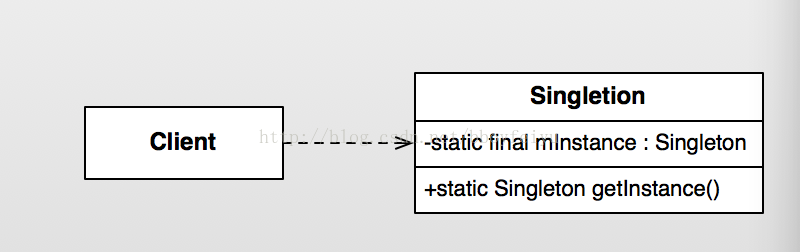
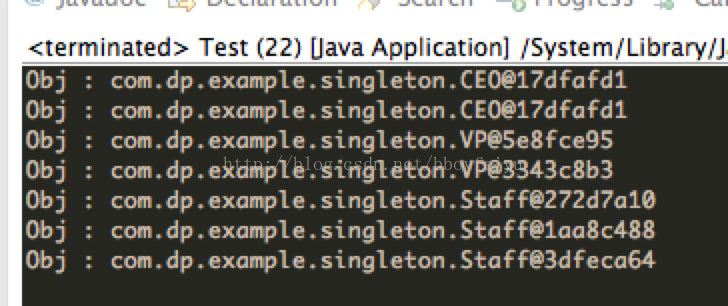

Android设计模式源码解析之单例模式 
====================================
> 本文为 [Android 设计模式源码解析](https://github.com/simple-android-framework-exchange/android_design_patterns_analysis) 中 单例模式 分析  
> Android系统版本： 2.3        
> 分析者：[Mr.Simple](https://github.com/bboyfeiyu)，分析状态：完成，校对者：[Mr.Simple](https://github.com/bboyfeiyu)，校对状态：完成   
 

## 1. 模式介绍  
 
###  模式的定义
确保某一个类只有一个实例，而且自行实例化并向整个系统提供这个实例。


### 模式的使用场景
确保某个类有且只有一个对象的场景，例如创建一个对象需要消耗的资源过多，如要访问 IO 和数据库等资源。
 

## 2. UML类图
  

### 角色介绍
* Client : 高层客户端。
* Singleton : 单例类。


## 3. 模式的简单实现
###  简单实现的介绍
单例模式是设计模式中最简单的，只有一个单例类，没有其他的层次结构与抽象。该模式需要确保该类只能生成一个对象，通常是该类需要消耗太多的资源或者没有没有多个实例的理由。例如一个公司只有一个CEO、一台电脑通常只有一个显示器等。下面我们以公司里的CEO为例来简单演示一下，一个公司可以有几个VP，无数个员工，但是CEO只有一个，请看下面示例。 

### 实现源码

```java
package com.dp.example.singleton;
/**
 * 人的基类
 * @author mrsimple
 *
 */
public abstract class Person {
	public abstract void talk() ;
}

// 普通员工
public class Staff extends Person {

	@Override
	public void talk() {

	}

}

// 副总裁
public class VP extends Person {

	@Override
	public void talk() {

	}
}

// CEO， 单例模式
public class CEO extends Person {

	private static final CEO mCeo = new CEO();

	private CEO() {
	}

	public static CEO getCeo() {
		return mCeo;
	}

	@Override
	public void talk() {
		System.out.println("CEO发表讲话");
	}

}

// 公司类
import java.util.ArrayList;
import java.util.List;

public class Company {
	private List<Person> allPersons = new ArrayList<Person>();

	public void addStaff(Person per) {
		allPersons.add(per);
	}

	public void showAllStaffs() {
		for (Person per : allPersons) {
			System.out.println("Obj : " + per.toString());
		}
	}
}

// test
public class Test {
	public static void main(String[] args) {
		Company cp = new Company() ;
		Person ceo1 = CEO.getCeo() ;
		Person ceo2 = CEO.getCeo() ;
		cp.addStaff(ceo1);
		cp.addStaff(ceo2);
		
		Person vp1 = new VP() ;
		Person vp2 = new VP() ;
		
		Person staff1 = new Staff() ;
		Person staff2 = new Staff() ;
		Person staff3 = new Staff() ;
		
		cp.addStaff(vp1);
		cp.addStaff(vp2);
		cp.addStaff(staff1);
		cp.addStaff(staff2);
		cp.addStaff(staff3);
		
		cp.showAllStaffs();
	}
}
```    

输出结果如下 : 
    

可以看到, CEO两次输出的CEO对象的文字描述都是一样的，而VP、Staff类的对象都是不同的。即CEO是唯一实例，而其他类型都是不同的实例。这个实现的核心在于将CEO类的构造方法私有化，使得外部程序不能通过构造函数来构造CEO对象，而CEO类通过一个静态方法返回一个唯一的对象。


### 单例模式的其他实现

```java
package com.dp.example.singleton;

public class Singleton {
	private static Singleton mInstance = null;

	private Singleton() {

	}

	public void doSomething() {
		System.out.println("do sth.");
	}

	/**
	 * 方式二、double-check， 避免并发时创建了多个实例, 该方式不能完全避免并发带来的破坏.
	 * 
	 * @return
	 */
	public static Singleton getInstance() {
		if (mInstance == null) {
			synchronized (Singleton.class) {
				if (mInstance == null) {
					mInstance = new Singleton();
				}
			}
		}
		return mInstance;
	}

	/**
	 * 方式三 : 在第一次加载SingletonHolder时初始化一次mOnlyInstance对象, 保证唯一性, 也延迟了单例的实例化,
	 * 如果该单例比较耗资源可以使用这种模式.
	 * 
	 * @return
	 */
	public static Singleton getInstanceFromHolder() {
		return SingletonHolder.mOnlyInstance;
	}

	/**
	 * 静态内部类
	 * 
	 * @author mrsimple
	 *
	 */
	private static class SingletonHolder {
		private static final Singleton mOnlyInstance = new Singleton();
	}

	/**
	 *  方式四 : 枚举单例, 线程安全
	 * @author mrsimple
	 *
	 */
	enum SingletonEnum {
		INSTANCE;
		public void doSomething() {
			System.out.println("do sth.");
		}
	}

	/**
	 * 方式五 : 注册到容器, 根据key获取对象.一般都会有多种相同属性类型的对象会注册到一个map中
	 * instance容器
	 */
	private static Map<string singleton=""> objMap = new HashMap<string singleton="">();
	/**
	 * 注册对象到map中
	 * @param key
	 * @param instance
	 */
	public static void registerService(String key, Singleton instance) {
		if (!objMap.containsKey(key) ) {
			objMap.put(key, instance) ;
		}
	}
	
	/**
	 * 根据key获取对象
	 * @param key
	 * @return
	 */
	public static Singleton getService(String key) {
		return objMap.get(key) ;
	}

}
```    
不管以哪种形式实现单例模式，它们的核心原理都是将构造函数私有化，并且通过静态方法获取一个唯一的实例，在这个获取的过程中你必须保证线程安全、反序列化导致重新生成实例对象等问题，该模式简单，但使用率较高。       

## Android源码中的模式实现
在Android系统中，我们经常会通过Context获取系统级别的服务，比如WindowsManagerService, ActivityManagerService等，更常用的是一个叫LayoutInflater的类。这些服务会在合适的时候以单例的形式注册在系统中，在我们需要的时候就通过Context的getSystemService(String name)获取。我们以LayoutInflater为例来说明, 平时我们使用LayoutInflater较为常见的地方是在ListView的getView方法中。 

```java
@Override
public View getView(int position, View convertView, ViewGroup parent)	
	View itemView = null;
	if (convertView == null) {
		itemView = LayoutInflater.from(mContext).inflate(mLayoutId, null);
		// 其他代码
	} else {
		itemView = convertView;
	}
	// 获取Holder
	// 初始化每项的数据
	return itemView;
}
```

通常我们使用LayoutInflater.from(Context)来获取LayoutInflater服务, 下面我们看看LayoutInflater.from(Context)的实现。

```
    /**
     * Obtains the LayoutInflater from the given context.
     */
    public static LayoutInflater from(Context context) {
        LayoutInflater LayoutInflater =
                (LayoutInflater) context.getSystemService(Context.LAYOUT_INFLATER_SERVICE);
        if (LayoutInflater == null) {
            throw new AssertionError("LayoutInflater not found.");
        }
        return LayoutInflater;
    }
```  

可以看到from(Context)函数内部调用的是Context类的getSystemService(String key)方法，我们跟踪到Context类看到, 该类是抽象类。

```java
public abstract class Context {
    // 省略
}
```     

使用的getView中使用的Context对象的具体实现类是什么呢 ？其实在Application，Activity, Service,中都会存在一个Context对象，即Context的总个数为Activity个数 + Service个数 + 1。而ListView通常都是显示在Activity中，那么我们就以Activity中的Context来分析。    

我们知道，一个Activity的入口是ActivityThread的main函数。在该main函数中创建一个新的ActivityThread对象，并且启动消息循环(UI线程)，创建新的Activity、新的Context对象，然后将该Context对象传递给Activity。下面我们看看ActivityThread源码。    

```java
    public static void main(String[] args) {
        SamplingProfilerIntegration.start();

        // CloseGuard defaults to true and can be quite spammy.  We
        // disable it here, but selectively enable it later (via
        // StrictMode) on debug builds, but using DropBox, not logs.
        CloseGuard.setEnabled(false);

        Environment.initForCurrentUser();

        // Set the reporter for event logging in libcore
        EventLogger.setReporter(new EventLoggingReporter());
        Process.setArgV0("<pre-initialized>");
        // 主线程消息循环
        Looper.prepareMainLooper();
        // 创建ActivityThread对象
        ActivityThread thread = new ActivityThread();
        thread.attach(false);

        if (sMainThreadHandler == null) {
            sMainThreadHandler = thread.getHandler();
        }

        AsyncTask.init();

        if (false) {
            Looper.myLooper().setMessageLogging(new
                    LogPrinter(Log.DEBUG, "ActivityThread"));
        }

        Looper.loop();

        throw new RuntimeException("Main thread loop unexpectedly exited");
    }

    private void attach(boolean system) {
        sThreadLocal.set(this);
        mSystemThread = system;
        if (!system) {
            ViewRootImpl.addFirstDrawHandler(new Runnable() {
                public void run() {
                    ensureJitEnabled();
                }
            });
            android.ddm.DdmHandleAppName.setAppName("<pre-initialized>",
                                                    UserHandle.myUserId());
            RuntimeInit.setApplicationObject(mAppThread.asBinder());
            IActivityManager mgr = ActivityManagerNative.getDefault();
            try {
                mgr.attachApplication(mAppThread);
            } catch (RemoteException ex) {
                // Ignore
            }
        } else {
               // 省略
        }
}
```    

在main方法中，我们创建一个ActivityThread对象后，调用了其attach函数，并且参数为false. 在attach函数中， 参数为false的情况下， 会通过Binder机制与ActivityManagerService通信，并且最终调用handleLaunchActivity函数 ( 具体分析请参考老罗的博客 : [Activity的启动流程](http://blog.csdn.net/luoshengyang/article/details/6689748))，我们看看该函数的实现 。     

```java

    private void handleLaunchActivity(ActivityClientRecord r, Intent customIntent) {
        // 代码省略
        Activity a = performLaunchActivity(r, customIntent);
        // 代码省略
    }
    
     private Activity performLaunchActivity(ActivityClientRecord r, Intent customIntent) {
        // System.out.println("##### [" + System.currentTimeMillis() + "] ActivityThread.performLaunchActivity(" + r + ")");
        // 代码省略
        Activity activity = null;
        try {
            java.lang.ClassLoader cl = r.packageInfo.getClassLoader();
            activity = mInstrumentation.newActivity(         // 1 : 创建Activity
                    cl, component.getClassName(), r.intent);
         // 代码省略
        } catch (Exception e) {
         // 省略
        }

        try {
            Application app = r.packageInfo.makeApplication(false, mInstrumentation);

            if (activity != null) {
                Context appContext = createBaseContextForActivity(r, activity); // 2 : 获取Context对象
                CharSequence title = r.activityInfo.loadLabel(appContext.getPackageManager());
                Configuration config = new Configuration(mCompatConfiguration);
                // 3: 将appContext等对象attach到activity中
                activity.attach(appContext, this, getInstrumentation(), r.token,
                        r.ident, app, r.intent, r.activityInfo, title, r.parent,
                        r.embeddedID, r.lastNonConfigurationInstances, config);

                // 代码省略
                // 4 ： 调用Activity的onCreate方法
                mInstrumentation.callActivityOnCreate(activity, r.state);
                // 代码省略
        } catch (SuperNotCalledException e) {
            throw e;
        } catch (Exception e) {
            // 代码省略
        }

        return activity;
    }


    private Context createBaseContextForActivity(ActivityClientRecord r,
            final Activity activity) {
        // 5 ： 创建Context对象, 可以看到实现类是ContextImpl
        ContextImpl appContext = new ContextImpl();           appContext.init(r.packageInfo, r.token, this);
        appContext.setOuterContext(activity);

        // 代码省略
        return baseContext;
    }
    
```   

通过上面1~5的代码分析可以知道， Context的实现类为ComtextImpl类。我们继续跟踪到ContextImpl类。 

```java
class ContextImpl extends Context {
  
    // 代码省略
    /**
     * Override this class when the system service constructor needs a
     * ContextImpl.  Else, use StaticServiceFetcher below.
     */
     static class ServiceFetcher {
        int mContextCacheIndex = -1;

        /**
         * Main entrypoint; only override if you don't need caching.
         */
        public Object getService(ContextImpl ctx) {
            ArrayList<Object> cache = ctx.mServiceCache;
            Object service;
            synchronized (cache) {
                if (cache.size() == 0) {
                    for (int i = 0; i < sNextPerContextServiceCacheIndex; i++) {
                        cache.add(null);
                    }
                } else {
                    service = cache.get(mContextCacheIndex);
                    if (service != null) {
                        return service;
                    }
                }
                service = createService(ctx);
                cache.set(mContextCacheIndex, service);
                return service;
            }
        }

        /**
         * Override this to create a new per-Context instance of the
         * service.  getService() will handle locking and caching.
         */
        public Object createService(ContextImpl ctx) {
            throw new RuntimeException("Not implemented");
        }
    }

    // 1 : service容器
    private static final HashMap<String, ServiceFetcher> SYSTEM_SERVICE_MAP =
            new HashMap<String, ServiceFetcher>();

    private static int sNextPerContextServiceCacheIndex = 0;
    // 2: 注册服务器
    private static void registerService(String serviceName, ServiceFetcher fetcher) {
        if (!(fetcher instanceof StaticServiceFetcher)) {
            fetcher.mContextCacheIndex = sNextPerContextServiceCacheIndex++;
        }
        SYSTEM_SERVICE_MAP.put(serviceName, fetcher);
    }


    // 3: 静态语句块, 第一次加载该类时执行 ( 只执行一次, 保证实例的唯一性. )
    static {
        //  代码省略
        // 注册Activity Servicer
        registerService(ACTIVITY_SERVICE, new ServiceFetcher() {
                public Object createService(ContextImpl ctx) {
                    return new ActivityManager(ctx.getOuterContext(), ctx.mMainThread.getHandler());
                }});

        // 注册LayoutInflater service
        registerService(LAYOUT_INFLATER_SERVICE, new ServiceFetcher() {
                public Object createService(ContextImpl ctx) {
                    return PolicyManager.makeNewLayoutInflater(ctx.getOuterContext());
                }});
        // 代码省略
    }

    // 4: 根据key获取对应的服务, 
    @Override
    public Object getSystemService(String name) {
        // 根据name来获取服务
        ServiceFetcher fetcher = SYSTEM_SERVICE_MAP.get(name);
        return fetcher == null ? null : fetcher.getService(this);
    }

    // 代码省略
}

```     

从ContextImpl类的部分代码中可以看到，在虚拟机第一次加载该类时会注册各种服务，其中就包含了LayoutInflater Service, 将这些服务以键值对的形式存储在一个HashMap中，用户使用时只需要根据key来获取到对应的服务，从而达到单例的效果。这种模式就是上文中提到的“单例模式的实现方式5”。系统核心服务以单例形式存在，减少了资源消耗。         


## 4. 杂谈
### 优点与缺点
#### 优点  
* 由于单例模式在内存中只有一个实例，减少了内存开支，特别是一个对象需要频繁地创建、销毁时，而且创建或销毁时性能又无法优化，单例模式的优势就非常明显。
* 由于单例模式只生成一个实例，所以减少了系统的性能开销，当一个对象的产生需要比较多的资源时，如读取配置、产生其他依赖对象时，则可以通过在应用启动时直接产生一个单例对象，然后用永久驻留内存的方式来解决；
* 单例模式可以避免对资源的多重占用，例如一个写文件动作，由于只有一个实例存在内存中，避免对同一个资源文件的同时写操作。
* 单例模式可以在系统设置全局的访问点，优化和共享资源访问，例如可以设计一个单例类，负责所有数据表的映射处理。

#### 缺点 
* 单例模式一般没有接口，扩展很困难，若要扩展，除了修改代码基本上没有第二种途径可以实现。 
