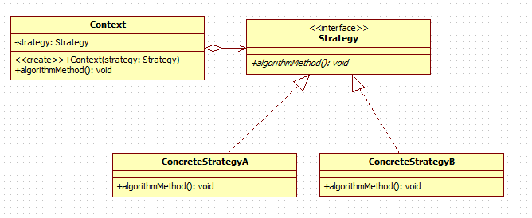
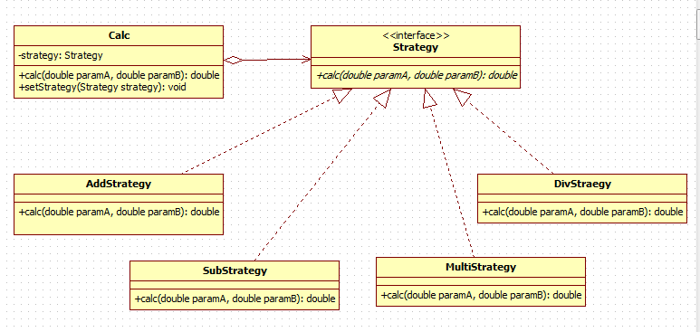
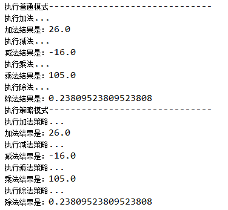
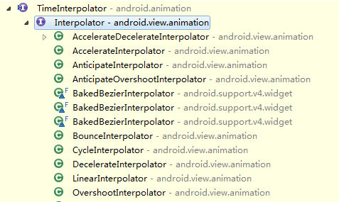
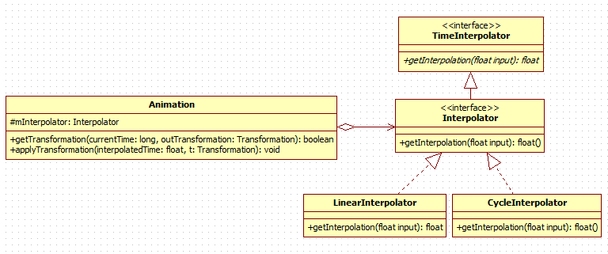

Android设计模式源码解析之策略模式 
====================================
> 本文为 [Android 设计模式源码解析](https://github.com/simple-android-framework/android_design_patterns_analysis) 中策略模式分析  
> Android系统版本：4.4.2         
> 分析者：[GKerison](https://github.com/GKerison)，分析状态：已完成，校对者：[Mr.Simple](https://github.com/bboyfeiyu)，校对状态：完成   

## 1. 模式介绍  
 
###  模式的定义
**策略模式定义了一系列的算法，并将每一个算法封装起来，而且使它们还可以相互替换。策略模式让算法独立于使用它的客户而独立变化。**

`注：针对同一类型操作，将复杂多样的处理方式分别开来，有选择的实现各自特有的操作。`

### 模式的使用场景
* 针对同一类型问题的多种处理方式，仅仅是具体行为有差别时。
* 需要安全的封装多种同一类型的操作时。
* 出现同一抽象多个子类，而又需要使用if-else 或者 switch-case来选择时。
 

## 2. UML类图
  

### 角色介绍
* Context：用来操作策略的上下文环境。
* Strategy : 策略的抽象。
* ConcreteStrategyA、ConcreteStrategyB : 具体的策略实现。


## 3. 模式的简单实现
###  简单实现的介绍
通常如果一个问题有多个解决方案或者稍有区别的操作时，最简单的方式就是利用if-else or switch-case方式来解决，对于简单的解决方案这样做无疑是比较简单、方便、快捷的，但是如果解决方案中包括大量的处理逻辑需要封装，或者处理方式变动较大的时候则就显得混乱、复杂，而策略模式则很好的解决了这样的问题，它将各种方案分离开来，让操作者根据具体的需求来动态的选择不同的策略方案。
这里以简单的计算操作(+、-、*、/)作为示例：

### 未使用策略模式

```java
	public static double calc(String op, double paramA, double paramB) {
		if ("+".equals(op)) {
			System.out.println("执行加法...");
			return paramA + paramB;
		} else if ("-".equals(op)) {
			System.out.println("执行减法...");
			return paramA - paramB;
		} else if ("*".equals(op)) {
			System.out.println("执行乘法...");
			return paramA * paramB;
		} else if ("/".equals(op)) {
			System.out.println("执行除法...");
			if (paramB == 0) {
				throw new IllegalArgumentException("除数不能为0!");
			}
			return paramA / paramB;
		} else {
			throw new IllegalArgumentException("未找到计算方法!");
		}
	}
```

### 使用策略模式
UML类图
  

* Calc：进行计算操作的上下文环境。
* Strategy : 计算操作的抽象。
* AddStrategy、SubStrategy、MultiStrategy、DivStrategy : 具体的 +、-、*、/ 实现。

具体实现代码如下：

```java 
	//针对操作进行抽象
	public interface Strategy {
		public double calc(double paramA, double paramB);
	}
	
	//加法的具体实现策略
	public class AddStrategy implements Strategy {
		@Override
		public double calc(double paramA, double paramB) {
			// TODO Auto-generated method stub
			System.out.println("执行加法策略...");
			return paramA + paramB;
		}
	}

	//减法的具体实现策略
	public class SubStrategy implements Strategy {
		@Override
		public double calc(double paramA, double paramB) {
			// TODO Auto-generated method stub
			System.out.println("执行减法策略...");
			return paramA - paramB;
		}
	}

	//乘法的具体实现策略
	public class MultiStrategy implements Strategy {
		@Override
		public double calc(double paramA, double paramB) {
			// TODO Auto-generated method stub
			System.out.println("执行乘法策略...");
			return paramA * paramB;
		}
	}

	//除法的具体实现策略
	public class DivStrategy implements Strategy {
		@Override
		public double calc(double paramA, double paramB) {
			// TODO Auto-generated method stub
			System.out.println("执行除法策略...");
			if (paramB == 0) {
				throw new IllegalArgumentException("除数不能为0!");
			}
			return paramA / paramB;
		}
	}

	//上下文环境的实现
	public class Calc {
		private Strategy strategy;
		public void setStrategy(Strategy strategy) {
			this.strategy = strategy;
		}
		
		public double calc(double paramA, double paramB) {
			// TODO Auto-generated method stub
			// doing something
			if (this.strategy == null) {
				throw new IllegalStateException("你还没有设置计算的策略");
			}
			return this.strategy.calc(paramA, paramB);
		}
	}


	//执行方法
	public static double calc(Strategy strategy, double paramA, double paramB) {
		Calc calc = new Calc();
		calc.setStrategy(strategy);
		return calc.calc(paramA, paramB);
	}
```

二者运行：

```java
	public static void main(String[] args) {
		double paramA = 5;
		double paramB = 21;
		
		System.out.println("------------- 普通形式 ----------------");
		System.out.println("加法结果是：" + calc("+", paramA, paramB));
		System.out.println("减法结果是：" + calc("-", paramA, paramB));
		System.out.println("乘法结果是：" + calc("*", paramA, paramB));
		System.out.println("除法结果是：" + calc("/", paramA, paramB));
		
		System.out.println("------------ 策略模式  ----------------");
		System.out.println("加法结果是：" + calc(new AddStrategy(), paramA, paramB));
		System.out.println("减法结果是：" + calc(new SubStrategy(), paramA, paramB));
		System.out.println("乘法结果是：" + calc(new MultiStrategy(), paramA, paramB));
		System.out.println("除法结果是：" + calc(new DivStrategy(), paramA, paramB));
	}
```
	
结果为：

  

### 总结

通过简单的代码可以清晰的看出二者的优势所在，前者通过简单的if-else来解决问题，在解决简单问题事会更简单、方便，后者则是通过给予不同的具体策略来获取不同的结果，对于较为复杂的业务逻辑显得更为直观，扩展也更为方便。


## Android源码中的模式实现
日常的Android开发中经常会用到动画，Android中最简单的动画就是Tween Animation了，当然帧动画和属性动画也挺方便的，但是基本原理都类似，毕竟动画的本质都是一帧一帧的展现给用户的，只不要当fps小于60的时候，人眼基本看不出间隔，也就成了所谓的流畅动画。（注：属性动画是3.0以后才有的，低版本可采用[NineOldAndroids](https://github.com/JakeWharton/NineOldAndroids)来兼容。而动画的动态效果往往也取决于插值器Interpolator不同，我们只需要对Animation对象设置不同的Interpolator就可以实现不同的效果，这是怎么实现的呢？

首先要想知道动画的执行流程，还是得从View入手，因为Android中主要针对的操作对象还是View，所以我们首先到View中查找，我们找到了View.startAnimation(Animation animation)这个方法。   

```java
	public void startAnimation(Animation animation) {
		//初始化动画开始时间
        animation.setStartTime(Animation.START_ON_FIRST_FRAME);
		//对View设置动画
        setAnimation(animation); 
		//刷新父类缓存
        invalidateParentCaches();
		//刷新View本身及子View
        invalidate(true);
    }
```
考虑到View一般不会单独存在，都是存在于某个ViewGroup中，所以google使用动画绘制的地方选择了在ViewGroup中的drawChild(Canvas canvas, View child, long drawingTime)方法中进行调用子View的绘制。

```java	
	protected boolean drawChild(Canvas canvas, View child, long drawingTime) {
        return child.draw(canvas, this, drawingTime);
    }
```

再看下View中的draw(Canvas canvas, ViewGroup parent, long drawingTime)方法中是如何调用使用Animation的

```java
	boolean draw(Canvas canvas, ViewGroup parent, long drawingTime) {
		//...
		
		//查看是否需要清除动画信息
		final int flags = parent.mGroupFlags;
        if ((flags & ViewGroup.FLAG_CLEAR_TRANSFORMATION) == ViewGroup.FLAG_CLEAR_TRANSFORMATION) {
            parent.getChildTransformation().clear();
            parent.mGroupFlags &= ~ViewGroup.FLAG_CLEAR_TRANSFORMATION;
        }
	
		//获取设置的动画信息
	   	final Animation a = getAnimation();
        if (a != null) {
			//绘制动画
            more = drawAnimation(parent, drawingTime, a, scalingRequired);
            concatMatrix = a.willChangeTransformationMatrix();
            if (concatMatrix) {
                mPrivateFlags3 |= PFLAG3_VIEW_IS_ANIMATING_TRANSFORM;
            }
            transformToApply = parent.getChildTransformation();
        } else {
			//...
		}
	}
```

可以看出在父类调用View的draw方法中，会先判断是否设置了清除到需要做该表的标记，然后再获取设置的动画的信息，如果设置了动画，就会调用View中的drawAnimation方法，具体如下：

```java
	private boolean drawAnimation(ViewGroup parent, long drawingTime,
            Animation a, boolean scalingRequired) {

		Transformation invalidationTransform;
        final int flags = parent.mGroupFlags;
		//判断动画是否已经初始化过
        final boolean initialized = a.isInitialized();
        if (!initialized) {
            a.initialize(mRight - mLeft, mBottom - mTop, parent.getWidth(), parent.getHeight());
            a.initializeInvalidateRegion(0, 0, mRight - mLeft, mBottom - mTop);
            if (mAttachInfo != null) a.setListenerHandler(mAttachInfo.mHandler);
            onAnimationStart();
        }
		
		//判断View是否需要进行缩放
		final Transformation t = parent.getChildTransformation();
        boolean more = a.getTransformation(drawingTime, t, 1f);
        if (scalingRequired && mAttachInfo.mApplicationScale != 1f) {
            if (parent.mInvalidationTransformation == null) {
                parent.mInvalidationTransformation = new Transformation();
            }
            invalidationTransform = parent.mInvalidationTransformation;
            a.getTransformation(drawingTime, invalidationTransform, 1f);
        } else {
            invalidationTransform = t;
        }

		if (more) {
			//根据具体实现，判断当前动画类型是否需要进行调整位置大小，然后刷新不同的区域
            if (!a.willChangeBounds()) {
				//...
 				
			}else{
				//...
			}
		}
		return more;
	}
```

其中主要的操作是动画始化、动画操作、界面刷新。动画的具体实现是调用了Animation中的getTransformation(long currentTime, Transformation outTransformation,float scale)方法。

```java

	public boolean getTransformation(long currentTime, Transformation outTransformation,
            float scale) {
        mScaleFactor = scale;
        return getTransformation(currentTime, outTransformation);
    }
```

在上面的方法中主要是获取缩放系数和调用Animation.getTransformation(long currentTime, Transformation outTransformation)来计算和应用动画效果。
	
```java
	Interpolator mInterpolator;  //成员变量
	public boolean getTransformation(long currentTime, Transformation outTransformation) {
			//计算处理当前动画的时间点...
            final float interpolatedTime = mInterpolator.getInterpolation(normalizedTime);
			//后续处理，以此来应用动画效果...
            applyTransformation(interpolatedTime, outTransformation);
	    return mMore;
    }
```    

很容易发现Android系统中在处理动画的时候会调用插值器中的getInterpolation(float input)方法来获取当前的时间点，依次来计算当前变化的情况。这就不得不说到Android中的插值器Interpolator，它的作用是根据时间流逝的百分比来计算出当前属性值改变的百分比，系统预置的有LinearInterpolator（线性插值器：匀速动画）、AccelerateDecelerateInterpolator（加速减速插值器：动画两头慢中间快）和DecelerateInterpolator（减速插值器：动画越来越慢）等，如图：

 

由于初期比较旧的版本采用的插值器是TimeInterpolator抽象，google采用了多加一层接口继承来实现兼容也不足为怪了。很显然策略模式在这里作了很好的实现，Interpolator就是处理动画时间的抽象，LinearInterpolator、CycleInterpolator等插值器就是具体的实现策略。插值器与Animation的关系图如下：

 

这里以LinearInterpolator和CycleInterpolator为例：

- LinearInterpolator
	 
		public float getInterpolation(float input) {
	        return input;
	    }

- CycleInterpolator

	  	public float getInterpolation(float input) {
	        return (float)(Math.sin(2 * mCycles * Math.PI * input));
	    }    
	    
可以看出LinearInterpolator中计算当前时间的方法是做线性运算，也就是返回input*1，所以动画会成直线匀速播放出来，而CycleInterpolator是按照正弦运算，所以动画会正反方向跑一次，其它插值器依次类推。不同的插值器的计算方法都有所差别，用户设置插值器以实现动画速率的算法替换。       


## 4. 杂谈
策略模式主要用来分离算法，根据相同的行为抽象来做不同的具体策略实现。

通过以上也可以看出策略模式的优缺点：

优点：

* 结构清晰明了、使用简单直观。
* 耦合度相对而言较低，扩展方便。
* 操作封装也更为彻底，数据更为安全。

缺点：

* 随着策略的增加，子类也会变得繁多。
