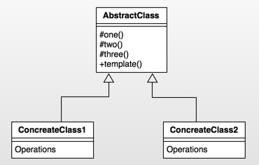
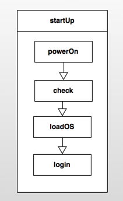
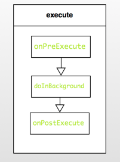

Android设计模式源码解析之模板方法模式 
====================================
> 本文为 [Android 设计模式源码解析](https://github.com/simple-android-framework-exchange/android_design_patterns_analysis) 中 模板方法模式 分析  
> Android系统版本： 2.3        
> 分析者：[Mr.Simple](https://github.com/bboyfeiyu)，分析状态：完成，校对者：[Mr.Simple](https://github.com/bboyfeiyu)，校对状态：完成   
 

## 1. 模式介绍  
 
###  模式的定义
定义一个操作中的算法的框架，而将一些步骤延迟到子类中。使得子类可以不改变一个算法的结构即可重定义该算法的某些特定步骤。


### 模式的使用场景
1. 多个子类有公有的方法，并且逻辑基本相同时。
2. 重要、复杂的算法，可以把核心算法设计为模板方法，周边的相关细节功能则由各个子类实现。
3. 重构时，模板方法模式是一个经常使用的模式，把相同的代码抽取到父类中，然后通过钩子函数约束其行为。
 

## 2. UML类图
  

### 角色介绍
* AbstractClass : 抽象类，定义了一套算法框架。 
* ConcreteClass1 : 具体实现类1；
* ConcreteClass2： 具体实现类2；


## 3. 模式的简单实现
###  简单实现的介绍
模板方法实际上是封装一个算法框架，就像是一套模板一样。而子类可以有不同的算法实现，在框架不被修改的情况下实现算法的替换。下面我们以开电脑这个动作来简单演示一下模板方法。开电脑的整个过程都是相对稳定的，首先打开电脑电源，电脑检测自身状态没有问题时将进入操作系统，对用户进行验证之后即可登录电脑，下面我们使用模板方法来模拟一下这个过程。 

### 实现源码

```java
package com.dp.example.templatemethod;

/**
 * 抽象的Computer
 * @author mrsimple
 *
 */
public abstract class AbstractComputer {

    protected void powerOn() {
        System.out.println("开启电源");
    }

    protected void checkHardware() {
        System.out.println("硬件检查");
    }

    protected void loadOS() {
        System.out.println("载入操作系统");
    }

    protected void login() {
        System.out.println("小白的电脑无验证，直接进入系统");
    }

    /**
     * 启动电脑方法, 步骤固定为开启电源、系统检查、加载操作系统、用户登录。该方法为final， 防止算法框架被覆写.
     */
    public final void startUp() {
        System.out.println("------ 开机 START ------");
        powerOn();
        checkHardware();
        loadOS();
        login();
        System.out.println("------ 开机 END ------");
    }
}


package com.dp.example.templatemethod;

/**
 * 码农的计算机
 * 
 * @author mrsimple
 */
public class CoderComputer extends AbstractComputer {
    @Override
    protected void login() {
        System.out.println("码农只需要进行用户和密码验证就可以了");
    }
}


package com.dp.example.templatemethod;

/**
 * 军用计算机
 * 
 * @author mrsimple
 */
public class MilitaryComputer extends AbstractComputer {
    
 
    @Override
    protected void checkHardware() {
        super.checkHardware();
        System.out.println("检查硬件防火墙");
    }
    
    @Override
    protected void login() {
        System.out.println("进行指纹之别等复杂的用户验证");
    }
}


package com.dp.example.templatemethod;

public class Test {
    public static void main(String[] args) {
        AbstractComputer comp = new CoderComputer();
        comp.startUp();

        comp = new MilitaryComputer();
        comp.startUp();

    }
}

```    

输出结果如下 :    

```
------ 开机 START ------
开启电源
硬件检查
载入操作系统
码农只需要进行用户和密码验证就可以了
------ 开机 END ------
------ 开机 START ------
开启电源
硬件检查
检查硬件防火墙
载入操作系统
进行指纹之别等复杂的用户验证
------ 开机 END ------
```
   
通过上面的例子可以看到，在startUp方法中有一些固定的步骤，依次为开启电源、检查硬件、加载系统、用户登录四个步骤，这四个步骤是电脑开机过程中不会变动的四个过程。但是不同用户的这几个步骤的实现可能各不相同，因此他们可以用不同的实现。而startUp为final方法，即保证了算法框架不能修改，具体算法实现却可以灵活改变。startUp中的这几个算法步骤我们可以称为是一个套路，即可称为模板方法。因此，模板方法是定义一个操作中的算法的框架，而将一些步骤延迟到子类中。使得子类可以不改变一个算法的结构即可重定义该算法的某些特定步骤。如图 :    




## Android源码中的模式实现
在Android中，使用了模板方法且为我们熟知的一个典型类就是AsyncTask了，关于AsyncTask的更详细的分析请移步Android中AsyncTask的使用与源码分析，我们这里只分析在该类中使用的模板方法模式。     

在使用AsyncTask时，我们都有知道耗时的方法要放在doInBackground(Params... params)中，在doInBackground之前如果还想做一些类似初始化的操作可以写在onPreExecute方法中，当doInBackground方法执行完成后，会执行onPostExecute方法，而我们只需要构建AsyncTask对象，然后执行execute方法即可。我们可以看到，它整个执行过程其实是一个框架，具体的实现都需要子类来完成。而且它执行的算法框架是固定的，调用execute后会依次执行onPreExecute,doInBackground,onPostExecute,当然你也可以通过onProgressUpdate来更新进度。我们可以简单的理解为如下图的模式  :
	
	   

下面我们看源码，首先我们看执行异步任务的入口, 即execute方法 :     


```java
 public final AsyncTask<Params, Progress, Result> execute(Params... params) {
        return executeOnExecutor(sDefaultExecutor, params);
    }

    public final AsyncTask<Params, Progress, Result> executeOnExecutor(Executor exec,
            Params... params) {
        if (mStatus != Status.PENDING) {
            switch (mStatus) {
                case RUNNING:
                    throw new IllegalStateException("Cannot execute task:"
                            + " the task is already running.");
                case FINISHED:
                    throw new IllegalStateException("Cannot execute task:"
                            + " the task has already been executed "
                            + "(a task can be executed only once)");
            }
        }

        mStatus = Status.RUNNING;

        onPreExecute();

        mWorker.mParams = params;
        exec.execute(mFuture);

        return this;
    }

```

可以看到execute方法(为final类型的方法)调用了executeOnExecutor方法，在该方法中会判断该任务的状态，如果不是PENDING状态则抛出异常，这也解释了为什么AsyncTask只能被执行一次，因此如果该任务已经被执行过的话那么它的状态就会变成FINISHED。继续往下看，我们看到在executeOnExecutor方法中首先执行了onPreExecute方法，并且该方法执行在UI线程。然后将params参数传递给了mWorker对象的mParams字段，然后执行了exec.execute(mFuture)方法。        

mWorker和mFuture又是什么呢？其实mWorker只是实现了Callable接口，并添加了一个参数数组字段，关于Callable和FutureTask的资料请参考[Java中的Runnable、Callable、Future、FutureTask的区别与示例](http://blog.csdn.net/bboyfeiyu/article/details/24851847)，我们挨个来分析吧，跟踪代码我们可以看到，这两个字段都是在构造函数中初始化。

```java
   public AsyncTask() {
        mWorker = new WorkerRunnable<Params, Result>() {
            public Result call() throws Exception {
                mTaskInvoked.set(true);

                Process.setThreadPriority(Process.THREAD_PRIORITY_BACKGROUND);
                return postResult(doInBackground(mParams));
            }
        };

        mFuture = new FutureTask<Result>(mWorker) {
            @Override
            protected void done() {
                try {
                    final Result result = get();

                    postResultIfNotInvoked(result);
                } catch (InterruptedException e) {
                    android.util.Log.w(LOG_TAG, e);
                } catch (ExecutionException e) {
                    throw new RuntimeException("An error occured while executing doInBackground()",
                            e.getCause());
                } catch (CancellationException e) {
                    postResultIfNotInvoked(null);
                } catch (Throwable t) {
                    throw new RuntimeException("An error occured while executing "
                            + "doInBackground()", t);
                }
            }
        };
    }
```  

简单的说就是mFuture就包装了这个mWorker对象，会调用mWorker对象的call方法，并且将之返回给调用者。      
	关于AsyncTask的更详细的分析请移步[Android中AsyncTask的使用与源码分析](http://blog.csdn.net/bboyfeiyu/article/details/8973058)，我们这里只分析模板方法模式。总之，call方法会在子线程中调用，而在call方法中又调用了doInBackground方法，因此doInBackground会执行在子线程。doInBackground会返回结果，最终通过postResult投递给UI线程。
	我们再看看postResult的实现 :     
	
```java
    private Result postResult(Result result) {
        Message message = sHandler.obtainMessage(MESSAGE_POST_RESULT,
                new AsyncTaskResult<Result>(this, result));
        message.sendToTarget();
        return result;
    }

    private static class InternalHandler extends Handler {
        @SuppressWarnings({"unchecked", "RawUseOfParameterizedType"})
        @Override
        public void handleMessage(Message msg) {
            AsyncTaskResult result = (AsyncTaskResult) msg.obj;
            switch (msg.what) {
                case MESSAGE_POST_RESULT:
                    // There is only one result
                    result.mTask.finish(result.mData[0]);
                    break;
                case MESSAGE_POST_PROGRESS:
                    result.mTask.onProgressUpdate(result.mData);
                    break;
            }
        }
    }


    private void finish(Result result) {
        if (isCancelled()) {
            onCancelled(result);
        } else {
            onPostExecute(result);
        }
        mStatus = Status.FINISHED;
    }

```     

可以看到，postResult就是把一个消息( msg.what == MESSAGE_POST_RESULT)发送给sHandler，sHandler类型为InternalHandler类型，当InternalHandler接到MESSAGE_POST_RESULT类型的消息时就会调用result.mTask.finish(result.mData[0])方法。我们可以看到result为AsyncTaskResult类型，源码如下  :     
   

```java
    @SuppressWarnings({"RawUseOfParameterizedType"})
    private static class AsyncTaskResult<Data> {
        final AsyncTask mTask;
        final Data[] mData;

        AsyncTaskResult(AsyncTask task, Data... data) {
            mTask = task;
            mData = data;
        }
    }
```    

**可以看到mTask就是AsyncTask对象**，调用AsyncTask对象的finish方法时又调用了onPostExecute，这个时候整个执行过程就完成了。
	总之，execute方法内部封装了onPreExecute, doInBackground, onPostExecute这个算法框架，用户可以根据自己的需求来在覆写这几个方法，使得用户可以很方便的使用异步任务来完成耗时操作，又可以通过onPostExecute来完成更新UI线程的工作。       
	另一个比较好的模板方法示例就是Activity的声明周期函数，例如Activity从onCreate、onStart、onResume这些程式化的执行模板，这就是一个Activity的模板方法。       

## 4. 杂谈
### 优点与缺点
#### 优点  
* 封装不变部分，扩展可变部分
* 提取公共部分代码，便于维护

#### 缺点 
* 模板方法会带来代码阅读的难度，会让心觉得难以理解。 
